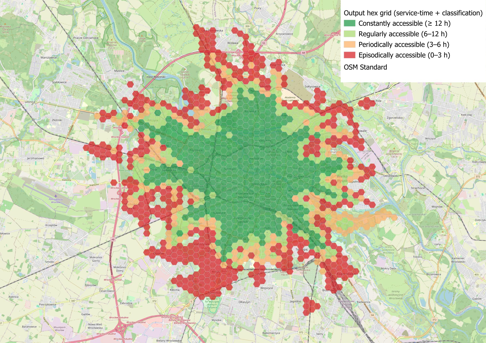
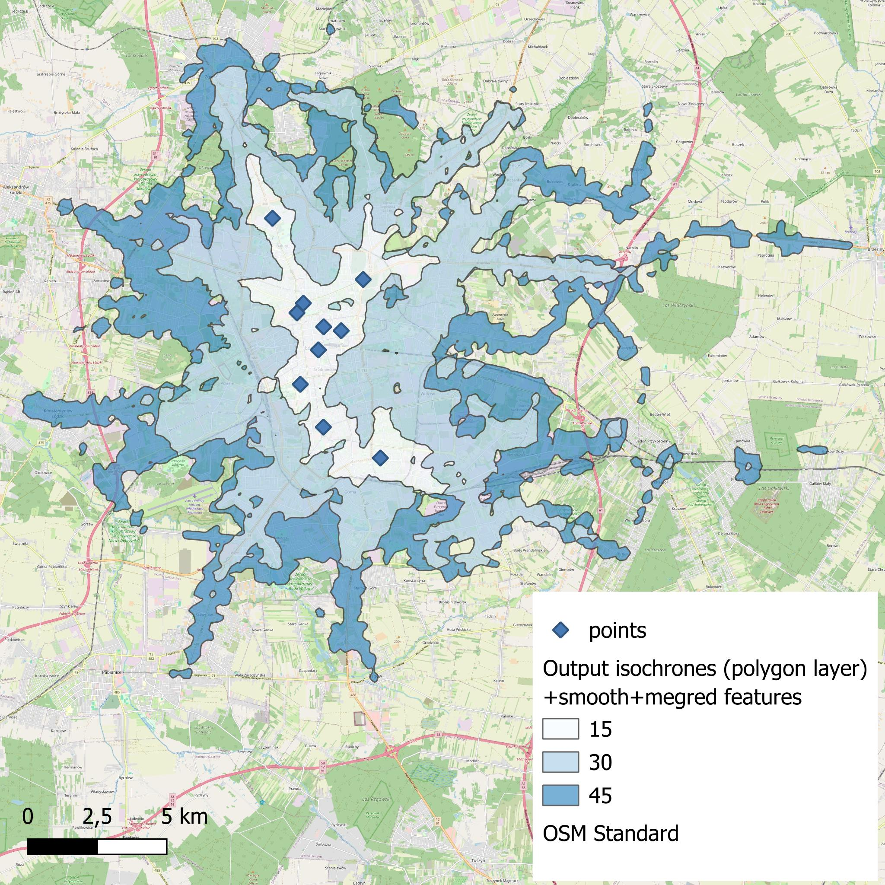
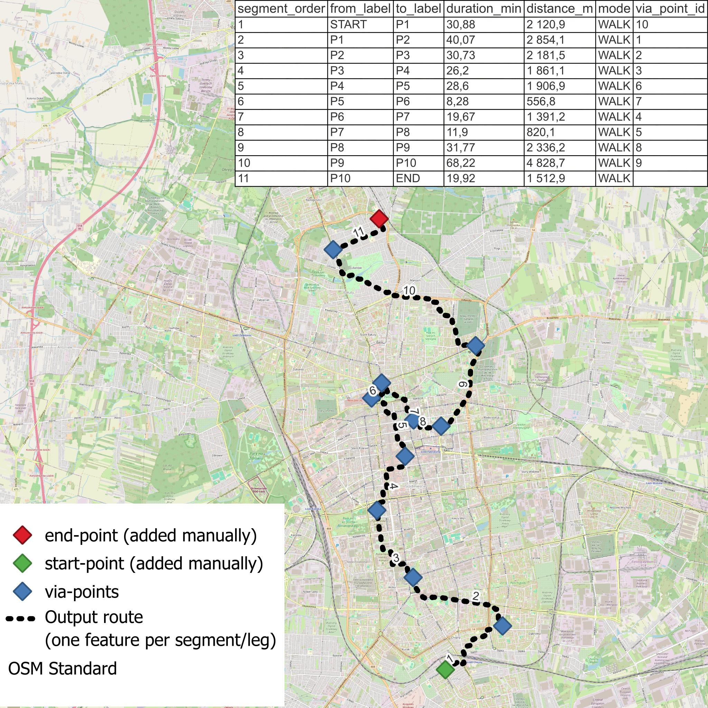

# easy-OTP

A QGIS processing plugin that automates temporal accessibility analysis for public
transport using OpenTripPlanner 1.5.0. For each minute of the analysis time window
the plugin generates one travel-time surface, counts how many minutes each hexagonal
grid cell is within your travel-time threshold, and classifies cells into four
service-time categories consistent with the academic literature.

Requires **QGIS 3.22 LTR** or newer. No R, no GRASS. One optional `pip install` (openpyxl) — see below.
The plugin UI is available in English and **Polish** *(new in v0.5)*.

---

## Example result



*Service-time classification generated by easy-OTP v0.2. Cells are classified into four categories based on how many minutes of the analysis window each location is within the travel-time threshold.*

---

## What analysis you can do

| Algorithm | Description |
| --- | --- |
| [**Run temporal accessibility**](#run-temporal-accessibility-the-main-algorithm) | Generates travel-time surfaces for each minute of an analysis window, counts minutes each grid cell is reachable, and classifies cells into four service-time categories |
| [**Count from existing surfaces**](#count-from-existing-surfaces-countfromexistingsurfaces) | Recomputes the count raster and hex classification from a folder of already-generated surface rasters, without re-running OTP |
| [**Generate isochrones**](#generate-isochrones-generateisochrones-new-in-v06) | Creates isochrone polygons for 1 to N origin/destination points with multiple travel-time cutoffs; supports FROM (reachable from) and TO (can reach) directions |
| [**Generate isochrones over time**](#generate-isochrones-over-time-generateisochronesovertime-new-in-v06) | Generates isochrone polygons iterated across a time window with temporal fields for day-long animation of service reach |
| [**Run service coverage**](#run-service-coverage-runservicecoverage-new-in-v06) | Multi-point service coverage analysis: "how many service points are reachable from each cell within threshold T?" |
| [**Run origin-destination times**](#run-origin-destination-times-runorigindestinationtimes-new-in-v05) | Batch point-to-point routing from many origins to one destination with trip statistics (duration, walk, wait, transfers) |
| [**Route via points**](#route-via-points-routeviapoints-new-in-v062) | City trip planner: orders a layer of via-points automatically and routes START → via-points → END as a per-segment line layer |
| [**Prepare student layer**](#prepare-student-layer-preparestudentlayer-new-in-v02) | Reads GUS NSP 2021 Excel files and joins census-tract population data to polygon geometry |
| [**Population overlay**](#population-overlay-populationoverlay-new-in-v02) | Overlays a demographic polygon layer on hexagonal grid using areal interpolation |
| [**Run realtime accessibility**](#realtime-algorithms-new-in-v04) | Temporal accessibility with live GTFS-RT delays applied instead of planned timetable |
| [**Record GTFS-RT feed**](#realtime-algorithms-new-in-v04) | Archives a GTFS-RT TripUpdates feed for offline analysis |
| [**Build realized GTFS**](#realtime-algorithms-new-in-v04) | Reconstructs a "realized" static GTFS from a RecordGtfsRt archive with P50/P85 segment times |
| [**Compare temporal accessibility**](#compare-temporal-accessibility-comparetemporalaccessibility-new-in-v035) | Computes differences between two accessibility scenarios (e.g. baseline vs. proposed, weekday vs. weekend) and produces delta rasters and classified hex grids |
| [**Run travel-time matrix**](#run-travel-time-matrix-runtraveltimematrix-new-in-v06) | Full N × M origin–destination travel-time matrix as CSV/XLSX or OD line layer for gravity models and accessibility reports |
| [**Generate hex grid**](#generate-hex-grid-generatehexgrid) | Builds the hexagonal grid used by accessibility analysis |

---

## What you need to run an analysis

| Requirement | Version | How to get it |
|---|---|---|
| QGIS | 3.22 LTR+ | Install from qgis.org; the plugin uses the bundled Python and GDAL |
| Java | **8 (1.8)** | Plugin can download it — [*Download Java 8 JRE and OpenTripPlanner Jar*](#getting-java-8-and-the-otp-jar) (or install manually) |
| OpenTripPlanner jar | **1.5.0** | Plugin can download it — [*Download Java 8 JRE and OpenTripPlanner Jar*](#getting-java-8-and-the-otp-jar) (`otp-1.5.0-shaded.jar`) |
| OSM extract | any | Plugin can download it — [*Download transit data*](#getting-osm-and-gtfs-data-new-in-v02) (`.osm.pbf` covering your study area) [or learn how to prepare your own OSM data](tools/custom_network.md) |
| GTFS feed(s) | any valid | Plugin can download it — [*Download transit data*](#getting-osm-and-gtfs-data-new-in-v02) (one or more `.zip` archives in a folder) |

You don't have to collect everything by hand — the plugin can download Java 8, the OTP
jar, the OSM extract and GTFS feeds for you after installation (see [Getting the prerequisites](#getting-the-prerequisites)).

---

## Installation

### Download

Download the latest release ZIP from GitHub:

**[easy-OTP Releases → https://github.com/GISBoost/easy-OTP/releases/latest](https://github.com/GISBoost/easy-OTP/releases/latest)**

Download `easy_otp-0.6.0.zip` from the Assets section. This is the correctly
structured plugin ZIP — do **not** use the auto-generated "Source code" archives
on the same page, as those have the wrong directory layout for QGIS.

### Plugin Installation

1. Download `easy_otp-0.6.0.zip` from the [Releases page](https://github.com/GISBoost/easy-OTP/releases/latest).
2. In QGIS: **Plugins → Manage and Install Plugins → Install from ZIP**.
3. Select the downloaded `easy_otp-0.6.0.zip` and click **Install Plugin**.
4. After installation, **Plugins → easy-OTP → Enable** (if not enabled
   automatically).
5. The algorithms appear in **Processing Toolbox** under the **easy-OTP** group.

### First-run dependency: openpyxl

The **Prepare Student Layer** (R1a) algorithm reads GUS NSP 2021 Excel files
using the `openpyxl` library. All other algorithms work without it.

When QGIS loads easy-OTP and `openpyxl` is not found in the Python environment,
a dialog appears with two choices:

- **Yes** — the plugin first tries to download the `openpyxl` wheel directly
  via `urllib` (in-process HTTPS, which works even on QGIS 3.22 where the child
  `pip` subprocess has no SSL); if that fails it falls back to
  `pip install openpyxl`. Requires internet access. Takes 5–30 seconds. No QGIS
  restart is needed in most cases.
- **No** — the plugin loads normally. All algorithms except R1a work without
  openpyxl; R1a will raise an error if you try to run it without the library.

If automatic installation fails (e.g. no internet access), install manually from
the **OSGeo4W Shell** (Windows) or a terminal with QGIS's Python:

```
python -m pip install openpyxl
```

Then restart QGIS.

#### Verify the installation

In the **QGIS Python console** (Plugins → Python Console):

```python
from openpyxl import load_workbook
print("openpyxl OK")
```

If you see `openpyxl OK`, R1a is ready to use.

---

## Getting the prerequisites

After installing the plugin you can collect the remaining inputs — Java 8, the OTP
jar, the OSM extract and the GTFS feeds — directly from the Processing Toolbox.

### Getting Java 8 and the OTP jar

OTP 1.5.0 requires **exactly Java 8** plus the `otp-1.5.0-shaded.jar`. One algorithm
downloads both.

#### Automated (recommended) *(new in v0.2)*

The easiest way to get both prerequisites is to use the built-in
**Download Java 8 JRE and OpenTripPlanner Jar** algorithm
(Processing Toolbox → easy-OTP → **Setup**):

1. Open the Processing Toolbox and find **easy-OTP → Setup → Download Java
   8 JRE and OpenTripPlanner Jar**.
2. Set **Destination folder** to an empty folder (e.g. `C:\otp\tools\` on
   Windows or `~/otp/tools/` on Linux/macOS).
3. Leave **Save paths to QSettings** checked (default).
4. Click **Run**. The algorithm will:
   - Fetch the latest Temurin 8 JRE from the Adoptium API and verify its
     SHA-256 checksum.
   - Unpack the archive and locate the `java` binary.
   - Download `otp-1.5.0-shaded.jar` (~60 MB) from the GitHub Releases page
     and verify the file is a valid JAR (ZIP format, 50–80 MB).
   - Save both paths to QSettings so **Test OTP server** and
     **Run temporal accessibility** pick them up automatically — no manual
     path entry needed.

**Platform support:** Windows x64, Linux x64, macOS x64 (Intel).
Apple Silicon and ARM Linux are not supported in v0.2 — use the manual
methods below and choose the native build for your architecture.

Running the algorithm a second time on the same folder detects existing files
and exits in seconds (cache hit for each independently), so it is safe to
re-run.

#### Manual fallback

If the automated download fails (firewall, offline setup), get the two files by hand.

**Java 8.** Use a portable (no-installer) build so you can keep it separate from any
other Java on your machine.

1. Go to **Eclipse Temurin releases**:
   `https://adoptium.net/temurin/releases/?version=8`
2. Select your OS, architecture (x64), package type **zip** (Windows) or
   **tar.gz** (Linux/Mac), version **JRE** (a full JDK works too).
3. Unpack the archive. Recommended: keep it together with your OTP jar and
   analysis data in one dedicated folder, e.g.:
   - Windows: `C:\otp\java\`
   - Linux/Mac: `~/otp/java/`
4. Note the path to the `java` executable:
   - Windows: `C:\otp\java\bin\java.exe`
   - Linux/Mac: `~/otp/java/bin/java`

You will enter this path in the **Java 8 binary** parameter of the plugin.

**otp-1.5.0-shaded.jar.**

1. Go to the GitHub Releases page:
   `https://github.com/opentripplanner/OpenTripPlanner/releases/tag/v1.5.0`
2. Download `otp-1.5.0-shaded.jar` (~60 MB). Do **not** download the plain
   `otp-1.5.0.jar` — it is not executable on its own.
3. Save it in your OTP folder alongside Java and your analysis data, e.g.
   `C:\otp\otp-1.5.0-shaded.jar`.

You will enter this path in the **OpenTripPlanner 1.5.0 jar** parameter.

> **Tip — keep everything in one folder.** The recommended layout is:
> ```
> C:\otp\
> ├── java\                   ← unpacked portable Java 8 JRE
> ├── otp-1.5.0-shaded.jar    ← OTP executable
> ├── graphs\
> │   └── city\
> │       ├── city.osm.pbf    ← OSM extract
> │       └── city_gtfs.zip   ← GTFS feeds
> └── work\                   ← working directory for the plugin
> ```
> This way all OTP-related files are in one place and easy to back up or move.

### Getting OSM and GTFS data *(new in v0.2)*

The **Download transit data (OSM + GTFS)** algorithm automates the two most
tedious data-collection steps: finding the right OSM extract for your study
area, and finding and downloading the relevant GTFS feeds.

**Processing Toolbox → easy-OTP → Setup → Download transit data (OSM + GTFS)**

#### Prerequisites

A **free Transitland API key** is required to download GTFS data.
Register at **https://www.transit.land** (no credit card, takes about a minute).
[OSM data from Geofabrik](https://download.geofabrik.de/) does not require any account.

#### Running the algorithm

| Parameter | Value |
|---|---|
| **Area name** | Geofabrik area id or name — e.g. `dolnoslaskie`, `mazowieckie`, `berlin` |
| **Destination folder** | An empty folder; the algorithm creates `osm/` and `gtfs/` inside it |
| **Download OSM extract** | ✓ (uncheck if you already have a local `.osm.pbf`) |
| **Download GTFS feed(s)** | ✓ (uncheck if you already have a local GTFS folder) |
| **Transitland API key** | Paste the key from your Transitland account |

After the run, the Processing log prints ready-to-paste paths:

```
OSM extract  →  C:\otp\data\osm\dolnoslaskie.osm.pbf
GTFS folder  →  C:\otp\data\gtfs\
```

Copy those directly into the **OSM extract** and **GTFS folder** parameters of
**Run temporal accessibility**.

#### Notes

- **OSM cache:** the OSM extract is cached for 7 days in `DEST_DIR/osm/`.
  Re-running the algorithm on the same folder skips the download and exits in
  seconds (`"Using cached OSM extract"`).
- **GTFS always refreshed:** GTFS feeds are re-downloaded on every run (transit
  schedules change without a predictable cycle).
- **Continental feeds filtered automatically:** Transitland's bbox query can
  return national/continental aggregates (e.g. Germany-wide GTFS, FlixBus EU).
  The algorithm discards feeds whose geographic extent is more than 5× larger
  than the query area; only city- and sub-regional feeds are downloaded.
- **Missing operator:** if a local operator is not yet in Transitland, add
  their `.zip` manually to `DEST_DIR/gtfs/` after the algorithm finishes.

#### Own network

Want to model a network change (closed road, new footbridge, different
speed limit) instead of just downloading an extract? See
[Preparing a custom OSM network](tools/custom_network.md).

---

## Configuration

Open any easy-OTP algorithm in the Processing Toolbox. The key parameters to
configure once are in the **Advanced** section:

| Parameter | What to enter |
|---|---|
| **Java 8 binary** | Full path to `java.exe` / `java` from your portable Java 8 install |
| **OpenTripPlanner 1.5.0 jar** | Full path to `otp-1.5.0-shaded.jar` |
| **Working directory** | An empty folder where the plugin can write surfaces, graph cache, and logs |
| **OTP server port** | Default `8801`; change only if that port is taken |
| **OTP heap for graph build** | Default `2G`; increase to `4G` for large cities |
| **OTP heap for analyst server** | Default `4G`; increase if OTP crashes during surface generation |

Run **Diagnostics → Test OTP server** first to verify Java and jar are found
correctly before attempting a full run.

---

## Run temporal accessibility (the main algorithm)

>**How example folder structure would look like**
>```
>otp/
>├── graphs/
>│   └── wroclaw/
>│       ├── wroclaw.osm.pbf        ← OSM extract of the study area
>│       └── wroclaw_gtfs.zip       ← GTFS feed
>└── work/                          ← empty folder; plugin writes everything here
>```
>Note that algorithm will create new folder with hashed name inside *graphs* directory

1. Open **Processing Toolbox → easy-OTP → Analysis → Run temporal accessibility**.
2. Fill in the required parameters:
   - **OSM extract**: `wroclaw.osm.pbf`
   - **GTFS folder**: `wroclaw/`
   - **Origin point**: click the map to pick a central location (e.g. the main
     railway station)
   - **Analysis date**: a weekday date covered by your GTFS feed
   - **Window start / end**: `06:00` / `22:00`
   - **Sampling interval**: `1 min` (or `15 min` for a quick test)
   - **Travel-time threshold**: `30` minutes
   - **Working directory**: `work/`
   - **Arrive by** *(new in v0.3.5)*: leave unchecked for the default depart-at
     analysis, or check it to measure arrive-by accessibility (travel times are
     computed as journeys arriving at the origin within the analysis window).
3. In **Advanced**, enter the Java and jar paths configured above.
4. Enable **Generate hex grid** (or supply your own polygon grid layer).
5. Click **Run**.

The plugin will:
- Build the OTP graph (first run only; subsequent runs use the cache).
- Start the OTP analyst server.
- Generate one travel-time surface per minute.
- Count pixels below the threshold.
- Run zonal statistics on the hex grid.
- Classify cells into four service-time categories.
- Load the result into QGIS with the built-in style applied.
- Save the **origin point** as a named vector layer with run metadata fields:
  `run_date`, `run_time`, `time_window`, `interval_min`, `router_id`, `arrive_by`
  *(new in v0.5)*.

A full 1-minute window run (961 surfaces) on Wrocław-sized data takes roughly
20–25 minutes. A 15-minute window run (65 surfaces) takes about 2 minutes.

---

## Count from existing surfaces (CountFromExistingSurfaces)

**Processing Toolbox → easy-OTP → Analysis → Count from existing surfaces**

Re-runs the counting → zonal-stats → classification part of the pipeline
directly from a folder of already-generated `surface_*.tiff` files, without
starting OTP or regenerating any surfaces. Useful when you want to re-classify
with a different threshold, hex grid, or zonal statistic after a full run has
already produced the surfaces — saving the ~20+ minutes OTP would otherwise take.

*(screenshot/example coming soon)*

### How it works

Reuses the same counting, zonal-statistics, and classification code as
`RunTemporalAccessibility` (`core/zonal.py`) — only the surface-generation step
is skipped. Pixels below the chosen threshold are counted across all surface
files found in the input folder, then aggregated onto the hex grid and
classified into the same four service-time categories.

### Key parameters

| Parameter | Notes |
|---|---|
| **Surfaces folder** | Folder containing `surface_*.tiff` files from a single previous run. |
| **Travel-time threshold** | Same meaning as in `RunTemporalAccessibility`. |
| **Hex grid** | Polygon layer to aggregate the count raster onto. |

### Outputs

- A single-band **count raster** (0..N minutes reachable).
- A **hex-grid layer** classified into the four service-time categories.

### Limitations

- Trusts the folder contents — mixing surfaces from different runs (different
  intervals or dates) in one folder produces wrong results. Point it at a
  clean single-run subfolder (see [Known issues](#known-issues)).

---

## Generate isochrones (GenerateIsochrones) *(new in v0.6)*

**Processing Toolbox → easy-OTP → Analysis → Generate isochrones**

Creates isochrone polygons — the area reachable within a given travel time —
for 1 to N origin or destination points, at one moment in time, with multiple
cutoff thresholds (e.g. 15/30/45 min) in a single run.



### How it works

For each input point, the algorithm sends one request per cutoff set to OTP's
`/isochrone` endpoint and merges the returned polygons into one output layer.
Supports both directions: `FROM` (area reachable *from* the point) and `TO`
(area from which the point can be *reached*, using OTP's `fromPlace==toPlace`
workaround). Isochrone geometry is validated and repaired (`makeValid()`)
since OTP 1.5 occasionally returns self-intersecting polygons. Per-point
failures are logged as warnings and skipped rather than aborting the whole run.

### Key parameters

| Parameter | Default | Notes |
|---|---|---|
| **Origin/destination points** | — | Point layer, 1..N features. |
| **Direction** | FROM | `FROM` (reachable from) or `TO` (can reach). |
| **Transport mode** | TRANSIT | `TRANSIT`, `WALK`, `BUS`, `RAIL`, `TRAM`, `SUBWAY`, `CAR`, `BICYCLE`. WALK and TRANSIT are well tested; CAR/BICYCLE quality depends on graph coverage. |
| **Cutoffs (minutes)** | `15,30,45` | Comma-separated list of travel-time thresholds. |
| **Analysis date / Time** | — | Single moment in time. |

### Output layer fields

| Field | Type | Description |
|---|---|---|
| `point_id` | Integer | Id of the origin/destination point this polygon belongs to. |
| `name` | String | Label of the origin/destination point, if available. |
| `cutoff_min` | Integer | Travel-time cutoff for this polygon. |
| `mode` | String | Transport mode used. |
| `date` / `time` | String | Analysis date/time. |
| `direction` | String | `FROM` or `TO`. |

---

## Generate isochrones over time (GenerateIsochronesOverTime) *(new in v0.6)*

**Processing Toolbox → easy-OTP → Analysis → Generate isochrones over time**

Shows how a single point's isochrone shape changes across the day — e.g. the
30-minute reach at 6:00, 7:00, … 22:00 — without generating a full 961-surface
run. A middle ground between a single static isochrone and the full temporal
method.

https://github.com/user-attachments/assets/6890ba5f-151f-406b-95a1-74fcccf771c4

*Day-long animation of service reach for one point.*

### How it works

Reuses the same timestamp-building logic as `RunTemporalAccessibility`
(`core/time_utils.py`) and loops over each timestamp calling the isochrone
client. Each output polygon carries a `time` field compatible with the QGIS
**Temporal Controller**, so the result can be played back as a day-long
animation directly in QGIS.

### Key parameters

| Parameter | Default | Notes |
|---|---|---|
| **Origin point** | — | Single point. |
| **Direction** | FROM | Same as `GenerateIsochrones`. |
| **Transport mode** | TRANSIT | Same options as `GenerateIsochrones`. |
| **Cutoffs (minutes)** | — | 1–2 cutoffs recommended — cost multiplies by number of timestamps. |
| **Window start / end / interval** | 06:00 / 22:00 / 15 min | 15 min default (not 1 min) to avoid generating too many polygons per cutoff. |

### Output layer fields

| Field | Type | Description |
|---|---|---|
| `time` | String | Timestamp of this polygon — drives the Temporal Controller. |
| `cutoff_min` | Integer | Travel-time cutoff. |
| `mode` | String | Transport mode used. |
| `date` | String | Analysis date. |

### Performance notes

- 15-min interval, 16h window → 65 requests (~1 minute).
- 1-min interval → 961 requests, comparable in cost to the main algorithm's surface loop.
- Many points *and* many times at once is out of scope — this algorithm covers
  one point across many times; use `GenerateIsochrones` for many points at one time.

---

## Run service coverage (RunServiceCoverage) *(new in v0.6)*

**Processing Toolbox → easy-OTP → Analysis → Run service coverage**

Answers "how many service points are reachable from each cell within threshold
T, at a given moment?" — e.g. how many convenience stores, pharmacies, or
parcel lockers are within a 10-minute reach of each location. Generalises to
any point network you want to measure coverage against.

*(screenshot/example coming soon)*

### How it works

Generates one travel-time surface per service point (same surface-generation
code as `RunTemporalAccessibility`, but channels = service points instead of
minutes of the day). Per pixel, counts how many of the N surfaces are within
the threshold, producing a `reachable_count` raster (0..N). Optionally
aggregates that raster onto a hex grid, a square grid, or your own polygon
layer.

### Key parameters

| Parameter | Default | Notes |
|---|---|---|
| **Service points** | — | Point layer, N features (e.g. stores, pharmacies). |
| **Transport mode** | TRANSIT | Same mode options as the main algorithm. |
| **Threshold (minutes)** | 10 | Reachability cutoff. |
| **Analysis date / Time** | — | Single moment — multiple times is not supported (cost scales with N × times). |
| **Aggregation** | None | `None`, hex grid, square grid, or an existing polygon layer. |
| **Aggregation statistic** | max | `mean`, `max`, or `sum` — `max` matches "reachable at best" coverage questions. |

### Outputs

- A single-band **`reachable_count` raster** (0..N service points reachable per pixel).
- Optionally, a **grid layer** with a `reachable_<stat>` field.

### Performance notes

Cost scales with the number of service points, not with time-of-day sampling —
tens of points typically take minutes, not hours, once OTP has warmed up.

---

## Run origin-destination times (RunOriginDestinationTimes) *(new in v0.5)*

**Processing Toolbox → easy-OTP → Analysis → Run origin-destination times**

Batch point-to-point routing from many origins to one destination (or from
one destination to many origins). For each cell in an origin layer the algorithm
sends one `/plan` request to OTP and stores the resulting travel time in the
output attribute table. Designed for studies where you know the destination
(e.g. a hospital, a university campus, a railway station) and want to see the
travel time from every grid cell across the study area.

*(screenshot/example coming soon)*

### Direction

| Direction | OTP query | Typical use |
|---|---|---|
| **TO_DESTINATION** *(default)* | Depart from each origin, arrive at destination | "How long does it take to reach the hospital?" |
| **FROM_DESTINATION** | Depart from destination, arrive at each origin | Arrive-by equivalent — "Can you reach home from the station in time?" |

### Key parameters

| Parameter | Default | Notes |
|---|---|---|
| **Origins layer** | — | Any vector layer; hexagonal grids, census tracts, or point layers. Polygon centroids are used as OTP fromPlace. |
| **Destination (click on map)** | — | Single point. Snapped to WGS84 before sending to OTP. |
| **Direction** | TO_DESTINATION | See table above. |
| **Transport mode** | TRANSIT | `TRANSIT`, `WALK`, `CAR`, `BICYCLE`, `BUS`, `RAIL`, `TRAM`, `SUBWAY`. For transit modes, walking to/from stops is added automatically. |
| **Analysis date** | — | Date in YYYY-MM-DD format; must be covered by the GTFS feed in the graph. |
| **Departure time** | `08:00:00` | HH:MM:SS — applies to each origin independently. |
| **Include detail fields** | off | Adds `transittime`, `walktime`, `waitingtime`, `transfers` to the output. |
| **Concurrent workers** | 4 | Parallel HTTP requests to OTP. I/O-bound — safe to set above physical core count. Higher values speed up large grids but increase OTP RAM pressure. |
| **Snap origins to road network** | off | Snaps origin centroids to the nearest road segment before routing (requires a roads/OSM lines layer). Useful when origins fall slightly off the drivable network. |
| **Output table (.csv or .xlsx)** | *(optional)* | If provided, results are also exported to a flat file. Columns match the output layer. |

### Output layer fields

| Field | Type | Description |
|---|---|---|
| *[origin layer fields]* | *varies* | All attribute fields from the origins layer, copied verbatim. |
| `lat` | Double | WGS84 latitude of the origin centroid. |
| `lon` | Double | WGS84 longitude of the origin centroid. |
| `direction` | String | `TO_DESTINATION` or `FROM_DESTINATION` — same for all rows in a single run. |
| `mode` | String | Selected transport mode (e.g. `TRANSIT`) — same for all rows in a single run. |
| `status` | String | `OK` on success; OTP error code on failure (`404` = PATH_NOT_FOUND, `406` = NO_TRANSIT_TIMES, `409` = TOO_CLOSE, `410` = OUTSIDE_BOUNDS, `440`/`450` = geocode failure). |
| `duration` | Double | Total trip time in decimal minutes. `NULL` when status ≠ OK. |
| `transittime` | Double | Time aboard transit vehicles in decimal minutes *(detail mode only)*. |
| `walktime` | Double | Walking time in decimal minutes *(detail mode only)*. |
| `waitingtime` | Double | Waiting time for transit in decimal minutes *(detail mode only)*. |
| `transfers` | Integer | Number of transfers *(detail mode only)*. |
| `diag` | String | Raw OTP error message *(Diagnose unreachable origins mode only)*. |

### Performance notes

- 1 worker: ~3 min 15 s for ~1 900 origins (serial).
- 8 workers: ~30 s for the same grid (parallel HTTP requests).
- Workers are I/O-bound, not CPU-bound — setting `MAX_WORKERS` to 8–16 is
  safe even on a 4-core machine.
- Very large grids (10 000+ origins) may require reducing workers to avoid
  exhausting OTP's thread pool.

---

## Route via points (RouteViaPoints) *(new in v0.6.2)*

**Processing Toolbox → easy-OTP → Analysis → Route via points (city trip planner)**

Plans a tour through a START point, an END point, and an optional layer of
via-points (landmarks) — without you having to decide the visiting order. The
plugin orders the via-points automatically and routes through all of them,
producing one line feature per segment.



### How ordering works

Visit order is computed with a **nearest-neighbour + 2-opt** heuristic on
straight-line (haversine) distance between START, the via-points, and END —
pure Python, no OTP queries involved. This is fast but not always optimal on
the real pedestrian network (rivers, missing crossings, one-way streets can
make the straight-line-optimal order longer in practice). There is no manual
ordering option in v0.6.2.

### How routing works

The plugin sends one `/plan` query per segment (START→P1, P1→P2, …, Pn→END —
N+1 queries total), rather than a single query with `intermediatePlaces`,
because OTP 1.5.0 raises an NPE for `intermediatePlaces` that fall off the
street network. Each query returns one or more legs (a leg per mode switch);
each leg becomes one line feature in the output.

If OTP cannot route a segment (e.g. a via-point has no pedestrian access), that
segment is **skipped, not fatal** — the run continues, the Processing log names
the affected via-point's feature id, and all skipped segments are listed
together in the final summary so you can move or remove the offending points
and re-run.

### Key parameters

| Parameter | Default | Notes |
|---|---|---|
| **Start point** | — | Click on map. |
| **End point** | — | Click on map. |
| **Via-points layer** | *(optional)* | Point layer, 0..N features. 0 via-points = a direct START→END route. |
| **Transport mode** | WALK | `WALK`, `BICYCLE`, `CAR`, or `TRANSIT,WALK`. |
| **Analysis date / Departure time** | today / `08:30` | Used only by `TRANSIT,WALK`; ignored by WALK/BICYCLE/CAR. |
| **OSM extract** | — | `.osm.pbf` street network. |
| **GTFS folder** | *(optional)* | Required only for `TRANSIT,WALK`. |
| **Working directory** | — | Graph cache, as in the other Analysis algorithms. |
| **Maximum walk distance** | 50 000 m | City-tour default — a full walking tour, not a walk-to-stop leg. |
| **Walk reluctance** | 3 | Consistent with the rest of the plugin. |

A soft warning is shown when the via-points layer has **more than 20** features
— the route may be slow to compute and visually cluttered; consider splitting
the tour into smaller runs.

### Output layer fields

One feature per segment (leg):

| Field | Type | Description |
|---|---|---|
| `segment_order` | Integer | Position in the route, 1..k. |
| `from_label` / `to_label` | String | `START`, `P1`, `P2`, …, `END`. |
| `duration_min` | Double | Leg duration in decimal minutes. |
| `distance_m` | Double | Leg distance in metres. |
| `mode` | String | Mode of this leg (matches the selected transport mode; `TRANSIT,WALK` legs are split by mode). |
| `via_point_id` | LongLong | Feature id of the via-point ending this segment; empty for the last segment into END. |

The Processing log also reports total duration, total distance, the number of
via-points, and the computed visit order (as a list of feature ids) for
debugging.

### Limitations

- Visit order is optimised for straight-line distance, not the actual
  pedestrian network — occasionally suboptimal on real streets.
- `TRANSIT,WALK` mode splits legs by mode but does not otherwise change the
  ordering heuristic, which stays distance-based.
- No dwell time (time spent visiting each landmark) is modelled.
- Built on OTP 1.5's REST `/plan` endpoint, like the rest of the plugin; not
  portable to OTP 2.x.

---

## Prepare student layer (PrepareStudentLayer) *(new in v0.2)*

**Processing Toolbox → easy-OTP → Analysis → Prepare student layer**

Reads a GUS NSP 2021 Excel file and joins census-tract population data to a polygon
geometry layer. The output polygon layer is ready to pass directly as the
`POPULATION_LAYER` input to the Population overlay algorithm.

*(screenshot/example coming soon)*

The algorithm handles three observed states of GUS NSP 2021 files:

| State | Description |
|---|---|
| `raw` | Multi-row header (rows 0–5); `Symbol` contains only a short tract number; the join key is built by concatenating the region code from the preceding `rejon statystyczny` row. |
| `wrong` | Full 7-character keys already in `Symbol`; population values are strings with `'-'` as GUS suppression markers for small counts. |
| `done` | Clean, numeric values; minimum processing required. |

All three states produce identical output when joined with the same geometry layer.

### Parameters

| Parameter | Default | Description |
|---|---|---|
| **GUS NSP 2021 Excel file** | — | Path to the `.xlsx` file from the GUS website |
| **Sheet name** | *(first sheet)* | Required for multi-sheet files — see fixture notes below |
| **Population column name** | `pop20-29` | Column in the Excel header containing the population count (`20-29` in raw GUS exports) |
| **Census tract geometry layer** | — | Polygon layer with an `OBWOD` string field (or similar join key) |
| **Join key field** | `OBWOD` | Field in the geometry layer used to match Excel rows |
| **Output field name** | `pop20_29` | Name of the added Double field in the output layer |
| **Output layer** | — | Polygon layer with `pop20_29` (Double) added |

---

## Population overlay (PopulationOverlay) *(new in v0.2)*

**Processing Toolbox → easy-OTP → Analysis → Population overlay**

Overlays a demographic polygon layer on a hexagonal grid using areal interpolation
weighted by surface area. Each hexagon receives a `num_students` field (Float)
with the estimated number of persons from the chosen population group.

*(screenshot/example coming soon)*

The algorithm implements step 11 of the Kaczorowski & Wróblewski pipeline and
corresponds to the `ludnosc_studentow.model3` QGIS model, with one fix: the
reference model rounds sub-0.5 person fragments to zero (Integer field);
this implementation uses a Float field and preserves fractional counts.

| Parameter | Description |
|---|---|
| **Hex grid** | Polygon layer (output of *Run temporal accessibility* or *Generate hex grid*) |
| **Population layer** | Polygon layer with a numeric population field |
| **Population field** | Field containing person counts per polygon (default `pop20_29`) |
| **Output** | Hex grid with `num_students` field added (Float) |

The hex grid must be in a projected CRS with metric units (e.g. EPSG:2180,
EPSG:3857). If the population layer uses a different CRS it is reprojected
automatically before processing.

### End-to-end example (Prepare student layer + Population overlay)

```
Input files
├── reference_dolnoslaskie_ludnosc_nsp_2021-done.xlsx   ← GUS NSP 2021 Excel
└── wroclaw-su-brec-nsp-2021-obw.geojson                ← census tract geometry
```

**Step 1 — Run Prepare student layer:**

| Parameter | Value |
|---|---|
| GUS NSP 2021 Excel file | `reference_dolnoslaskie_ludnosc_nsp_2021-done.xlsx` |
| Sheet name | *(leave empty — single sheet)* |
| Population column name | `pop20-29` |
| Census tract geometry layer | `wroclaw-su-brec-nsp-2021-obw` |
| Join key field | `OBWOD` |
| Output field name | `pop20_29` |
| Output layer | `[Save to temporary layer]` |

**Fixture-specific notes:**
- `reference_ludnosc_nsp_2021_wrong.xlsx` — multi-sheet file; available sheets are
  `Małopolskie`, `Mazowieckie`, `Pomorskie`, `Wielkopolskie`. Set **Sheet name** to
  the voivodeship matching your geometry layer (no Dolnośląskie sheet in this file).
- `reference-nsp-2021-raw.xlsx` — raw GUS export; the age-group column is named
  `20-29` (not `pop20-29`), so set **Population column name** to `20-29`.

The output layer will have all original geometry attributes plus a new `pop20_29`
(Float) field. The Processing log reports the number of matched tracts, unmatched
tracts, and how many `'-'` values were converted to 0.

**Step 2 — Run Population overlay:**

| Parameter | Value |
|---|---|
| Hex grid | *(output of Run temporal accessibility, or your own polygon grid)* |
| Population layer | *(output from Step 1)* |
| Population field | `pop20_29` |
| Output | `[Save to file or temporary layer]` |

The result is your hex grid with a `num_students` field (Float) containing the
area-interpolated number of students aged 20–29 per hexagon.

> **Note — `OBWOD` stored as integer in QGIS:** if you re-imported the GeoJSON
> into a Shapefile and QGIS inferred `OBWOD` as an integer field, leading zeros
> in key values may be lost. Convert the field to text (`$str(OBWOD)` in the
> Field Calculator) before running R1a, or use the original GeoJSON directly.

---

## Realtime algorithms *(new in v0.4)*

Three algorithms under **easy-OTP → Realtime** measure or record what actually
happened on a given day, instead of what the planned timetable predicted.

**Important:** results from all three algorithms are **non-reproducible** — they
depend on live network conditions and snapshot data captured at a specific moment.
Output layers carry `analysis_type = "realtime"` to distinguish them from
static-analysis results.

### RunRealtimeAccessibility (RT-1)

**Processing Toolbox → easy-OTP → Realtime → Run realtime accessibility**

Runs the standard temporal-accessibility pipeline but with a live GTFS-RT
TripUpdates feed wired into OTP's `stop-time-updater`. OTP applies the real-time
delays before generating each travel-time surface.

*(screenshot/example coming soon)*

#### Key parameters

| Parameter | Notes |
|---|---|
| **GTFS-RT feed URL** | HTTP(S) endpoint returning a binary `FeedMessage` (.pb) |
| **Feed ID** | Must match exactly the `feed_id` OTP assigned to the loaded static GTFS (check the build log if unsure) |
| **All standard RunTemporalAccessibility parameters** | Same as the static analysis |

After the run, the Processing log reports the tri-state RT effectiveness:
`RT-EFFECTIVE` (delays applied), `RT-NOT-APPLIED` (OTP received updates but
matched zero trips — e.g. Poznań/Kraków namespace mismatch, see Known Issues),
or `RT-INCONCLUSIVE` (no update cycles completed).

### RecordGtfsRt (RT-2)

**Processing Toolbox → easy-OTP → Realtime → Record GTFS-RT feed**

Archives a GTFS-RT TripUpdates feed for offline analysis. Polls the feed at a
configurable interval and writes raw `.pb` snapshots plus a `recording.json`
manifest. Intended as input for RT-3.

*(screenshot/example coming soon)*

#### Key parameters

| Parameter | Notes |
|---|---|
| **GTFS-RT feed URL** | HTTP(S) endpoint |
| **Output directory** | Folder that will receive `*.pb` files and `recording.json` |
| **Poll interval** | 15–600 seconds (default 60 s) |
| **Recording duration** | Minutes to record (Cancel also stops safely) |

Cancel-safe: the manifest is written incrementally so a partial archive is always
valid input for RT-3.

### BuildRealizedGtfs (RT-3)

**Processing Toolbox → easy-OTP → Realtime → Build realized GTFS**

Reconstructs a "realized" static GTFS from a RecordGtfsRt archive. Aggregates
per-stop-pair segment times (keyed by `route_id`, `direction_id`, `from_stop_id`,
`to_stop_id`) and produces two output GTFS feeds:

*(screenshot/example coming soon)*

- **P50 feed** — median segment times (representative typical day)
- **P85 feed** — 85th-percentile segment times (pessimistic scenario)

Both output feeds can be passed directly to `RunTemporalAccessibility` to produce
a realized accessibility surface.

> **Note — google.protobuf required.** On first use, the plugin prompts to
> bootstrap `google.protobuf` via `dependencies.py` (same mechanism as openpyxl).
> The install takes 5–30 seconds and does not require admin rights or a QGIS restart.
> The library is needed only for RT-3; all other algorithms work without it.
>
> The output is an **approximation** — only trips with matched stop pairs in both
> the archive and the static GTFS are reconstructed. Trips with zero RT coverage
> retain planned times from the static feed.

### Reconstructing GTFS from vehicle positions only (no TripUpdates feed)

Cities that publish only GTFS-RT **VehiclePositions** with no TripUpdates feed (Warszawa,
Wrocław, Łódź — see Known Issues #13) can't use RT-2/RT-3 above. For these, a separate
standalone command-line tool, [`tools/family_a_reconstruction/`](tools/family_a_reconstruction/README.md),
reconstructs a realized GTFS from recorded vehicle positions via map-matching and
interpolation. **It is not a Processing algorithm** — it does not appear in the QGIS Toolbox
and requires its own Python environment. See its README for setup and a full worked example.

---

## Other algorithms

A few supporting algorithms that complete the toolset but are used less often
than the ones above.

### Compare temporal accessibility (CompareTemporalAccessibility) *(new in v0.3.5)*

**Processing Toolbox → easy-OTP → Analysis → Compare temporal accessibility**

Computes the difference between two accessibility scenarios — for example a
baseline timetable versus a proposed one, or a weekday versus a weekend.

*(screenshot/example coming soon)*

#### How it works

Runs zonal statistics and classification on both scenarios independently, then
computes a delta raster (Scenario B − Scenario A) and aggregates it onto the
hex grid. Cells present in only one scenario are written as **NoData** in the
delta, so a cell that gained or lost coverage entirely is not silently treated
as zero change.

#### Key parameters

| Parameter | Notes |
| --- | --- |
| **Scenario A / Scenario B** | Either two classified hex-grid layers or two count rasters produced by `RunTemporalAccessibility` / `CountFromExistingSurfaces`. Both inputs must be the same type. |
| **OSM extract** | The shared study-area extent common to both scenarios. |

#### Output layer fields

- A **delta raster** (Scenario B − Scenario A) of the service-time count.
- A **hex-grid layer** with a `delta_mean` field (mean change per cell) and a
  `delta_class` field classifying the change.

The output hex layer is styled automatically with the bundled
`easy_otp/styles/delta_class.qml`.

### Run travel-time matrix (RunTravelTimeMatrix) *(new in v0.6)*

**Processing Toolbox → easy-OTP → Analysis → Run travel-time matrix**

Generates a full N × M origin–destination travel-time matrix — the natural
generalisation of *Run origin-destination times* to multiple destinations. Use
it for gravity models and comparative accessibility reports rather than a
single named destination.

*(screenshot/example coming soon)*

#### How it works

Builds the Cartesian product of origins × destinations and routes each pair
through the same `/plan` client used by `RunOriginDestinationTimes`, in
parallel via `ThreadPoolExecutor`. Because the query count is N×M, the
algorithm warns before running large combinations (e.g. 100×100 = 10,000
queries) — prefer `RunServiceCoverage` instead when destinations represent
"opportunities" rather than specific named places.

#### Key parameters

| Parameter | Default | Notes |
|---|---|---|
| **Origins** | — | Point layer, N features. |
| **Destinations** | — | Point layer, M features. |
| **Transport mode / Analysis date / Time** | TRANSIT | Same as `RunOriginDestinationTimes`. |
| **Output format** | Long CSV | `Long CSV` (one row per OD pair), `Wide CSV` (origins × destinations matrix), or both. |
| **Metrics** | duration | Optional: transfers, walk time, wait time. |
| **Concurrent workers** | 4 | Same meaning as `RunOriginDestinationTimes`. |

#### Outputs

- A **long-format CSV/XLSX** (one row per OD pair; XLSX when `openpyxl` is available).
- Optionally a **wide-format matrix** (origins as rows, destinations as columns).
- Optionally an **OD line layer** for quick visualisation.

### Generate hex grid (GenerateHexGrid)

**Processing Toolbox → easy-OTP → Analysis → Generate hex grid**

Builds the hexagonal grid used across the plugin's Analysis algorithms —
either standalone or automatically when `RunTemporalAccessibility` /
`RunServiceCoverage` are run without an existing grid layer supplied.

*(screenshot/example coming soon)*

#### Key parameters

| Parameter | Default | Notes |
|---|---|---|
| **Extent** | — | Area to cover with the grid. |
| **Cell size** | 500 m | Hexagon size; smaller cells give finer detail at a higher processing cost. |

#### Outputs

A polygon layer of hexagonal cells, ready to use as the `HEX_GRID` input to
`RunTemporalAccessibility`, `RunServiceCoverage`, or `PopulationOverlay`.

---

## Running Unit Tests

The following tests do **not** require a running OTP server or QGIS:

```bash
python -m pytest easy_otp/test/test_time_utils.py -v
python -m pytest easy_otp/test/test_classification.py -v
```

The raster-counting tests require GDAL and must run inside the QGIS Python
interpreter (e.g. from the QGIS Python console or `python-qgis`):

```bash
python -m pytest easy_otp/test/test_raster_processing.py -v
```

---

## Troubleshooting

### "OTP 1.5.0 requires Java 8; detected version X"
Your `Java 8 binary` parameter points to a different Java version. Follow the
[Getting Java 8 and the OTP jar](#getting-java-8-and-the-otp-jar) section and update the parameter.

### "OTP 1.5.0 jar not found at: ..."
The path in `OpenTripPlanner 1.5.0 jar` is wrong or the file has not been
downloaded. Follow the [Getting Java 8 and the OTP jar](#getting-java-8-and-the-otp-jar)
section.

### "Port 8801 is held by a non-OTP process"
Something else is using port 8801. Either stop that service or change the
**OTP server port** parameter (e.g. to `8802`).

### OTP graph build fails
Check the build log at `<working directory>/otp_build_<hash>.log`. Common causes:
- **Wrong Java version** — verify with *Test OTP server*.
- **Corrupt GTFS** — OTP logs a specific error; re-download the feed.
- **Not enough memory** — increase `OTP heap for graph build` to `4G` or `8G`.

### All surfaces return "unreachable"
Run **Diagnostics → Test OTP server** and check the router diagnostic printed at
the start of the run:
- `hasTransit = False` → the GTFS was not loaded; check the build log.
- `transitServiceStarts / transitServiceEnds` does not cover `ANALYSIS_DATE` →
  use a date within your GTFS service range.
- `Origin (lat, lon)` outside the router polygon bbox → pick an origin point
  inside the OSM coverage area.

### Java process left running after QGIS crash
On Windows, open Task Manager and end any `java.exe` processes manually.
Under normal circumstances (including user-initiated Cancel) the plugin
terminates the OTP process automatically.

---

## Roadmap

This is an indicative plan and may change. Released features (arrive-by analysis,
XLSX/CSV report export, scenario comparison, population overlays R1a/R1b, and the
Java/OTP/data downloaders) are already part of v0.3.5. Planned and in-progress work:

- **Realtime accessibility** (`RunRealtimeAccessibility`) — service time from actual
  GTFS-RT delays instead of the planned timetable (v0.4, in progress on `feat/rt1-fix`).
- **GTFS-RT recording + realized timetable** (`RecordGtfsRt`, `BuildRealizedGtfs`) —
  archive RT snapshots and reconstruct a "realized" timetable for re-analysis (v0.5).
- **Validate GTFS feed** — diagnostic Setup algorithm checking feed correctness before analysis.
- **Multi-destination accessibility** — batch routing from many origins to one
  destination: **done** (`RunOriginDestinationTimes`, v0.5).
- **Walk-only isochrone** — static pedestrian isochrone as a baseline.
- **H3 grid** — H3 grid indexing alongside the plain hexagonal grid.
- **Car Dependency Index (CDI)** — car-vs-transit accessibility contrast module.
- **R5 engine (r5py)** — a faster engine for multi-origin analyses (likely a separate
  `easy-r5` plugin).
- **Quality-of-life** — arbitrary sampling interval (today only 1/15/60 min),
  algorithm-order cleanup, and minor UX improvements.

Tasks are tracked in [GitHub Issues](../../issues) — contributions and feedback are welcome.

---

## Known issues

A few confirmed limitations to be aware of:

- **Count raster vs original R reference** — the count algorithm is unit-tested and
  considered correct, but a controlled 1:1 comparison against the original R workflow
  (`wro_under_30.tif`) is not yet closed.
- **Sampling interval limited to 1 / 15 / 60 min** — no intermediate value (e.g. 5 or
  10 min) yet.
- **`maxWalkDistance` has no effect in analyst mode** — an OTP 1.5.0 limitation
  (the shortest-path tree is bounded by time, not distance); won't fix.
- **Mixing surface runs in one folder** — `CountFromExistingSurfaces` trusts the folder
  contents, so surfaces from different runs (different intervals/dates) in one folder give
  wrong results. Point it at a clean single-run subfolder.

- **RT-1 infeasible for Poznań and Kraków** — the live GTFS-RT TripUpdates feed uses
  trip_ids from a pipeline independent of the static GTFS (zero overlap). OTP logs
  `No pattern found for tripId` for every update; output is correctly marked
  `RT-NOT-APPLIED_`. Fix planned for v0.5 (RT-2/RT-3 path). Confirmed working city:
  **Gdańsk** ([#10](../../issues/10)).
- **Gdańsk (and similar feeds): same-day static GTFS required** — trip_ids encode the
  service date and regenerate daily; a stale static from the previous day causes all RT
  matches to fail silently. Re-download the static GTFS and rebuild the OTP graph on the
  same day as each `RunRealtimeAccessibility` session ([#11](../../issues/11)).

See [`KNOWN_ISSUES.md`](KNOWN_ISSUES.md) for the full (non-exhaustive) list and the
[issue tracker](../../issues) for progress.
