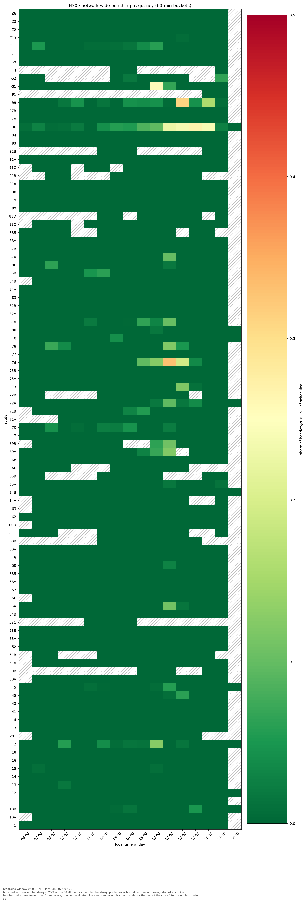
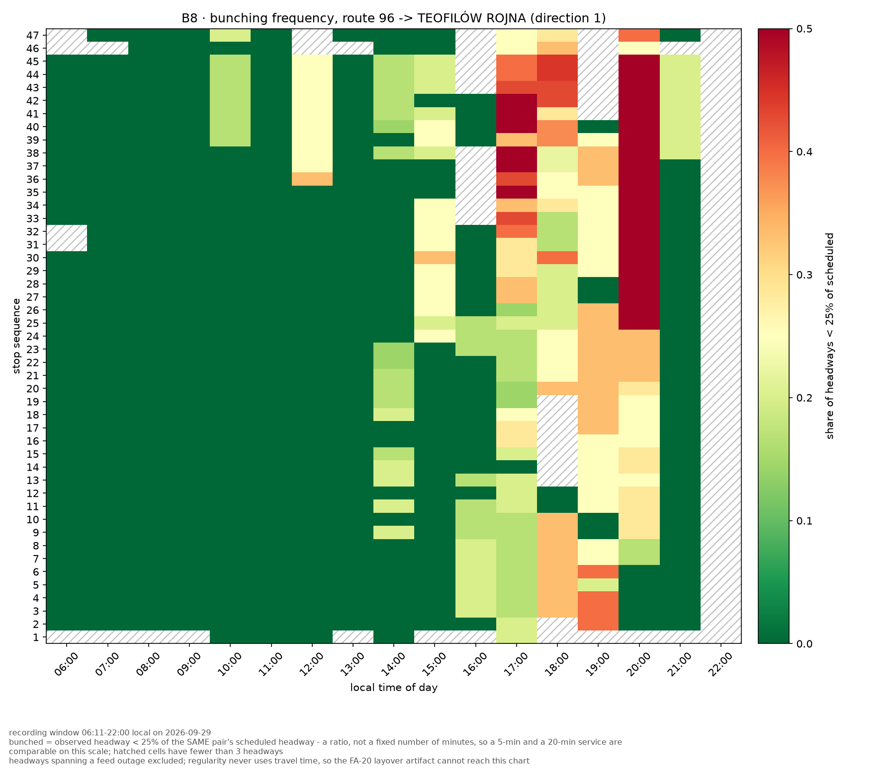
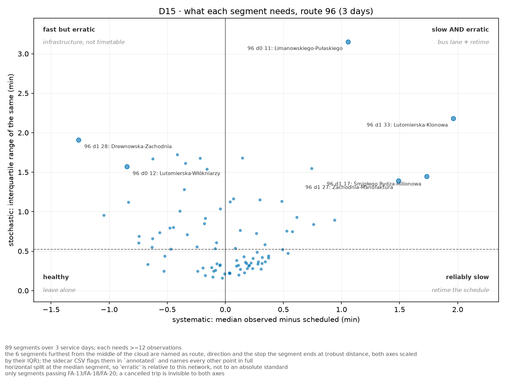
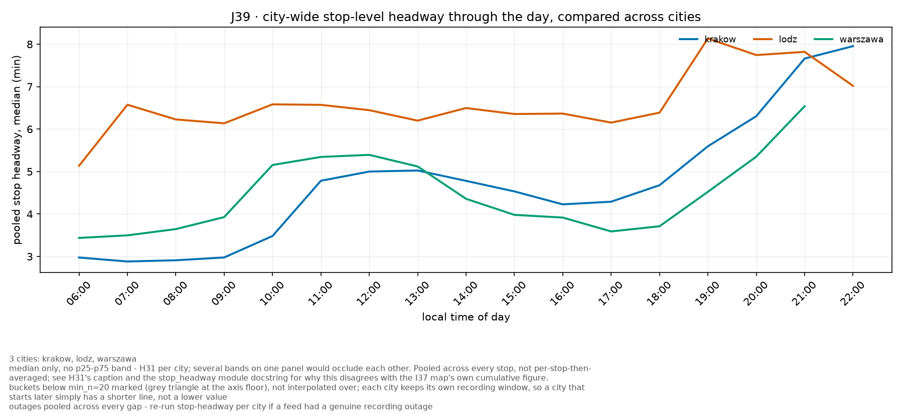

# chart_lab — przykłady analiz na danych z gtfs-dashboard

Cztery analizy zrobione na prawdziwych danych z katalogu
<https://gisboost.github.io/gtfs-dashboard/> (manifest z 2026-10-03). Każdą powtórzysz w
aplikacji (zakładka **Charts → Online catalogue**) albo jedną komendą CLI — oba sposoby dają ten
sam wynik, bo GUI woła ten sam kod. Instrukcja obsługi: [README.md](README.md).

**Użyte pliki** (wszystkie to tabele tidy, `…_tidy_<data>.csv.gz`, po 9–20 MB; dni `ok`):

| Plik | Do przykładów |
|---|---|
| `lodz_tidy_2026-09-28`, `…-29`, `…-30` | 1–3 |
| `krakow_tidy_2026-09-29`, `warszawa_tidy_2026-09-29` | 4 |

Komendy CLI uruchamiasz z folderu `tools	ransit_charts` (własne venv z matplotlib).

Pobranie w aplikacji: *Fetch available cities* → City → Month → Day → *Download and add to
active tables*. Poniższe komendy zakładają, że pliki leżą w bieżącym folderze (z aplikacji
znajdziesz je w `%TEMP%\chart_lab_cache`).

> **Jak czytać te wyniki.** To jedna doba (albo trzy) nagrania pozycji pojazdów, nie pełna
> statystyka. Wykresy opisują, *co* i *gdzie* wygląda nietypowo — przyczyny (korki, objazdy,
> awarie, zmiana rozkładu) trzeba sprawdzić osobno.

---

## 1. Gdzie w mieście pojazdy się zbijają (bunching, H30)

**Pytanie:** które linie i o jakich godzinach mają realny problem ze zbijaniem się pojazdów?

**Dane:** `lodz_tidy_2026-09-29.csv.gz` (jeden dzień, okno 06:03–22:00).

W aplikacji: *Chart* = `H30`. CLI:

```bat
py -m transit_charts.cli chart H30 --table lodz_tidy_2026-09-29.csv.gz --out-prefix out\lodz_H30
```



**Co widać.** Prawie cała mapa jest ciemnozielona (≈ 0% odstępów poniżej 25% rozkładowego).
Wyróżniają się pojedyncze linie w godzinach popołudniowych: **96** (jasne komórki od ok. 17:00 do
20:00), **76** (szczyt ok. 17:00), **99** (18:00 i 20:00), **G1** (16:00). Kreskowane komórki to
za mało obserwacji (< 3 odstępy), a nie „brak bunchingu".

Liczby dla całego dnia (te same dane, obliczone z `transit_charts.tidy.bunching_rate`,
min. 50 odstępów na linię; udział odstępów poniżej 25% rozkładowego):

| Linia | Odstępów | Zbunchowane |
|---|---|---|
| 96 | 7050 | 8,5% |
| 76 | 2739 | 4,6% |
| 99 | 3757 | 4,0% |
| G1 | 630 | 2,2% |
| 69B | 2159 | 2,2% |

Wniosek: bunching w tym dniu skupia się na kilku liniach, a nie jest problemem całej sieci —
dlatego następny przykład schodzi do linii 96.

> Uwaga z podpisu wykresu: jedna „zanieczyszczona" linia może zdominować skalę kolorów dla
> reszty miasta; w razie potrzeby wyklucz ją przez `--exclude-route 96`.

## 2. Gdzie na trasie i o której (B8, linia 96)

**Pytanie:** gdzie wzdłuż trasy linii 96 zaczyna się zbijanie i w jakich godzinach?

**Dane:** ten sam plik.

W aplikacji: *Chart* = `B8`, trasa `96`. CLI:

```bat
py -m transit_charts.cli chart B8 --table lodz_tidy_2026-09-29.csv.gz --route 96 --out-prefix out\lodz_B8_96
```



**Co widać** (kierunek 1, do Teofilowa Rojnej). Rano trasa jest czysta, w południe tylko
lekko zbunchowane są końcowe przystanki. Od ok. 16:00 zbijanie narasta, a w pasmach **17:00 i
20:00** dotyczy przede wszystkim **końcowej części trasy** (przystanki ok. 25–47), gdzie udział
odstępów poniżej 25% rozkładowego sięga 0,5 i więcej (skala wykresu jest ucięta na 0,5).
Początek trasy jest w tych godzinach wyraźnie łagodniejszy (ok. 0,2–0,35). To lokalizator
do dalszego sprawdzenia: dlaczego pojazdy zbliżają się do siebie właśnie w drugiej połowie
trasy (wąskie gardło, postój na pętli, rozkład).

## 3. Czy opóźnienie jest systematyczne, czy losowe (D15, linia 96, 3 dni)

**Pytanie:** na których odcinkach linii 96 jazda jest *stale* wolniejsza niż w rozkładzie (to
lekarstwo: zmiana rozkładu), a na których *nieprzewidywalna* (lekarstwo: infrastruktura, np.
buspas)?

**Dane:** `lodz_tidy_2026-09-28`, `…-29`, `…-30` — trzy kolejne dni robocze, wszystkie `ok`.
D15 wymaga ≥ 3 różnych dni.

W aplikacji: zaznacz wszystkie trzy tabele w *Active tables*, *Chart* = `D15`, trasa `96`. CLI:

```bat
py -m transit_charts.cli chart D15 ^
  --table lodz_tidy_2026-09-28.csv.gz --table lodz_tidy_2026-09-29.csv.gz --table lodz_tidy_2026-09-30.csv.gz ^
  --route 96 --out-prefix out\lodz_D15_96
```



**Co widać.** 89 odcinków międzyprzystankowych z ≥ 12 obserwacjami. Oś pozioma to mediana
(obserwowany − rozkładowy czas przejazdu, czyli część systematyczna), pionowa — rozstęp
międzykwartylowy (część losowa, dzień do dnia). Większość odcinków leży w „zdrowej" ćwiartce
(blisko zera, niski rozstęp). Opisane są odcinki najbardziej odstające:

- wolno **i** niestabilnie (prawa góra, „bus lane + retime"): **Limanowskiego–Pułaskiego**
  (kierunek 0, najwyższy rozstęp) i **Lutomierska–Klonowa**; w tej samej ćwiartce, z mniejszym
  rozstępem, **Śmigłego Rydza–Milionowa** i **Zachodnia–Manufaktura**,
- szybciej niż w rozkładzie, ale niestabilnie (lewa góra, „infrastruktura, nie rozkład"):
  **Drewnowska–Zachodnia** i **Lutomierska–Włókniarzy**.

Linia pozioma jest na medianie rozstępu tej sieci, więc „niestabilny" znaczy „względem reszty tej
linii". Odcinki „stale wolne, ale przewidywalne" (prawy dół) w tym zestawieniu nie wyróżniają się.

---

## 4. Porównanie miast (J39: Łódź, Kraków, Warszawa)

**Pytanie:** jak wygląda częstotliwość obsługi przystanków w ciągu dnia w kilku miastach?

**Dane:** po jednej tabeli z tej samej daty: `lodz_tidy_2026-09-29`, `krakow_tidy_2026-09-29`,
`warszawa_tidy_2026-09-29`. J39 wymaga ≥ 2 miast.

W aplikacji: wszystkie trzy tabele aktywne, *Chart* = `J39`. CLI:

```bat
py -m transit_charts.cli chart J39 ^
  --table lodz_tidy_2026-09-29.csv.gz --table krakow_tidy_2026-09-29.csv.gz ^
  --table warszawa_tidy_2026-09-29.csv.gz --out-prefix out\cities_J39
```



**Co widać.** Mediana odstępu na przystanku (zebrana ze wszystkich linii i przystanków). W
Krakowie i Warszawie szczyt częstotliwości jest rano i późnym popołudniem (ok. 3–4 min), a
wieczorem odstępy rosną do ok. 6–8 min. Łódź ma w ciągu dnia odstęp ok. 6–6,5 min i mniej
wyraźny szczyt. Każde miasto ma własne okno nagrania, więc krótsza linia oznacza krótsze
nagranie, a nie niższą wartość; w podpisie wykresu są też zastrzeżenia metodyczne (mediana, brak
pasma, przerwy w feedzie liczone łącznie).

---

## Co dalej: kilka pomysłów na własne analizy

- **Ten sam wykres, inny dzień.** Zamień plik na dzień weekendowy i porównaj H30 — sprawdzisz,
  czy bunching to cecha godzin szczytu dni roboczych.
- **Bunching jako liczba.** Wykres H30 jest tylko wizualizacją; ranking jak w tabeli w § 1 liczysz
  w Pythonie z tabeli tidy (kolumny `headway_s`, `sched_headway_s`, `route_short_name`, `stop_id`,
  `obs_local`):

  ```python
  import pandas as pd
  from transit_charts import tidy      # z tools/transit_charts

  df = pd.read_csv("lodz_tidy_2026-09-29.csv.gz", low_memory=False)
  rank = tidy.bunching_rate(df, ["route_short_name"], threshold=0.25, min_n=50)
  print(rank.sort_values("bunched_share", ascending=False).head(10))
  ```
- **Eksport do GIS.** `stop-headway` (zakładka *Stop headway*) daje `*_stops.csv` ze
  współrzędnymi przystanków — gotowe do wczytania w QGIS jako warstwa punktowa.
- **Realized GTFS do routingu.** `…_realized_<data>_p50.zip` + statyczny GTFS z tego samego dnia
  dają pary „plan vs rzeczywistość" do analiz dostępności w OTP/R5.

Pliki wynikowe (`.png`, `.csv` z liczbami, `.json` z parametrami) powstają zawsze razem —
CSV zawiera dokładnie te liczby, które narysowano.
