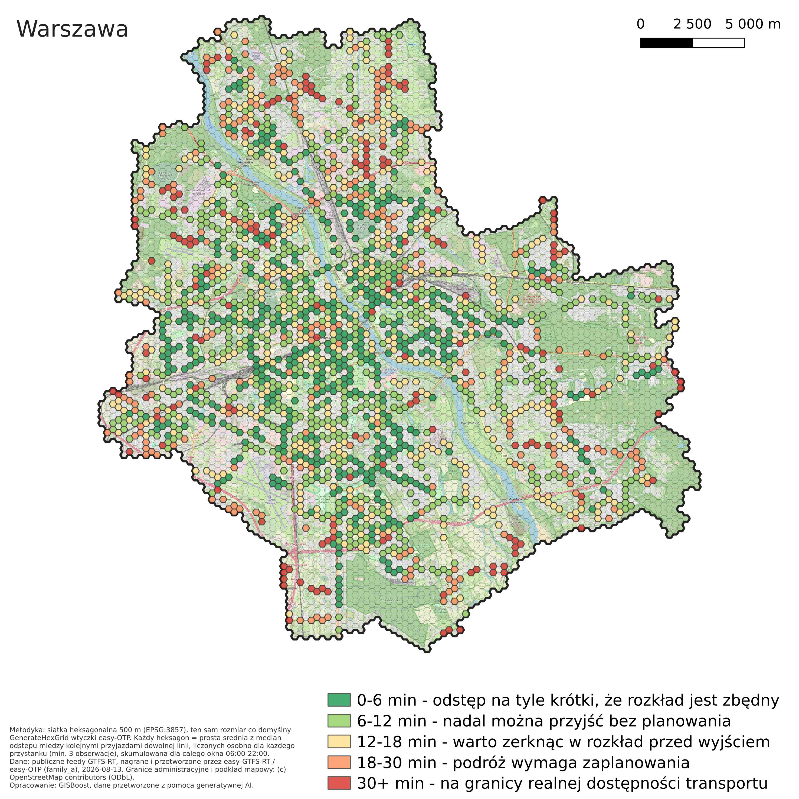

# tools/transit_charts — scheduled vs observed transit, charted

> **Standalone tool.** Not part of the easy-OTP QGIS plugin, never imported by `easy_otp/`.
> It consumes the `matched.csv` produced by
> [`tools/family_a_reconstruction`](../family_a_reconstruction/README.md) and the static GTFS zip
> of the same day.
>
> *Wersja polska (główna): [README.md](README.md).*

Builds the charts catalogued in `docs/handoffs/gtfs-rt-visualisation-catalogue_handoff.md` —
punctuality, regularity, speed, and (since the "city scale" extension) network-wide rankings and
heatmaps — from Family A's matched vehicle positions. Eighteen charts are built (eleven
per-route: A2, C9-C11, B5-B7, D14-D17, E20; five network-wide: B8, H28-H31; one cross-city:
J39, §11b) plus one map (I37, §11a — the only entry that needs QGIS); `F21` is deliberately
left for later.

The examples in this file come from a 10:07–21:59 window, so they contain no morning peak. A
full set from **a whole day (06:00–21:59, Łódź 2026-07-23), one folder per route for 10A, 11,
14, 15, 52, 55 and 69**, is in [`assets/full-day-example/`](assets/full-day-example/) — each
folder has its own `README.md` showing every chart of that route at once.

## Glossary

Abbreviations and jargon that recur throughout without being spelled out every time:

| term | expands to | what it means here |
|---|---|---|
| **CV** | *coefficient of variation* | `standard deviation / mean` of headway. Dimensionless — 0 is perfectly even, 0.25 is regarded as excellent, 0.42 is the US bus average. A 5-minute route and a 20-minute route sit on the same scale with no adjustment (see B5, H28) |
| **headway** | interval between consecutive vehicles of the same route/direction at the same stop | kept in English because that is the column name (`headway_s`) and the term the cited literature uses throughout |
| **AWT** | *actual wait time* | the wait a turn-up passenger who never checks the timetable actually experiences: `E[H²] / (2·E[H])`, not `E[H]/2` — an uneven interval pulls more passengers into the long gaps than the short ones |
| **SWT** | *scheduled wait time* | the same formula computed on the **scheduled** headways of the same pair of vehicles — the baseline for how long you would wait if everything ran exactly to plan |
| **EWT** | *excess wait time* | `EWT = AWT − SWT` — how many minutes of waiting come **purely from irregularity**, not from the route's frequency itself. Converts directly to passenger-minutes (the equity framing in B6/H29) |
| **bunching** | vehicles closing up into clusters | a pair (or more) of vehicles running unnaturally close together, with a large gap right behind them. B7/B8/H30 measure it as the share of headways below `--threshold` of their **own** scheduled interval — a ratio, not a fixed number of minutes, so routes of different frequency are comparable |
| **`seg_status`** | segment status in the tidy table | `ok` / `first_pair` / `stationary` / `implausible` / `gap` / `missing_stop_location` / `no_previous_stop` — `FA-*` rejections are **labelled, not applied**; every chart decides for itself what it tolerates (see §5, the tidy table) |
| **`FA-13`/`FA-14`/`FA-18`/`FA-20`** | `family_a_reconstruction` milestone numbers | filters inherited from the GTFS reconstruction: implausible-speed ceiling, GPS-bracket gap, stationary threshold, first stop pair (terminus layover). Full detail lives in that tool's PRD — here only *what* they filter matters |
| **P50 / P85** | median / 85th percentile | two "realized" GTFS variants `family_a build` produces from observed segment times. **Not the input to this tool** — see the appendix at the end of this document for why |
| **`route_short_name` / `route_group`** | timetable route name / grouped variant | `route_group` is `route_short_name` after optional `--group-variants` (e.g. `10A`+`10B` → `10`); most charts ask for `route_short_name` unless stated otherwise |
| **`direction_id` / `trip_headsign`** | 0/1 GTFS direction / the direction shown on the vehicle | chart titles give `trip_headsign` ("Chocianowice IKEA"), with `direction_id` kept in parentheses because that is what `--direction` takes |
| **tidy table** | `extract`'s shared output table | one row per scheduled stop of every processed trip; the source every chart reads (§5) |

---

## 1. Three branches, three different questions

The most common analytical mistake in this field is collapsing three different passenger
questions into the single word "delay". These are three separate quantities, measured
differently and sensitive to different things. The whole catalogue divides along them — and they
are called **branches**, not "families", because `family_a` is the proper name of the GTFS
reconstruction next door and conflating the two is a guaranteed misunderstanding.

| branch | passenger question | when it is the right metric | depends on the timetable? |
|---|---|---|---|
| **A/C — Punctuality** (schedule deviation) | "will it come at 15:07 as promised?" | infrequent routes, where people consult a timetable | **yes** |
| **B — Regularity** (headway) | "how long will I wait if I just turn up?" | frequent routes (under ~10 min) | **no** |
| **D — Speed / run time** | "how long will the journey take?" | always; the input to accessibility work | partly |

**The B branch is the one to trust most.** Headway is measured between vehicles, so nothing in
it depends on scheduled travel time, on the first-pair layover artifact (FA-20), or on the
matched table lining up with the right static feed version — the whole class of defects that
FA-16…FA-20 were about cannot reach it. For a route running every eight minutes it is also the
metric that matches what passengers do: nobody consults a timetable for it, they turn up.

The D branch demands the sharpest filters in exchange (`seg_status == "ok"`, i.e.
FA-13/FA-18/FA-20), because without them a terminus layover renders as a 1.5 km/h jam and looks
entirely plausible.

## 2. Why its own venv

`tools/family_a_reconstruction/requirements.txt` is also installed on the Termux phone that does
the recording, and **matplotlib has no wheels for Android's Bionic libc**. Keeping the plotting
dependency in a separate environment makes that constraint structural instead of something to
remember — the same reasoning `tools/analysis/requirements.txt` already documents.

The split has a second payoff: extraction is cached, so iterating on how a chart *looks* never
re-runs interpolation over Prague's 1.2 M rows.

```bat
cd tools\transit_charts
py -m venv .venv
.venv\Scripts\activate
pip install -r requirements.txt
```

`family_a` is imported by path from the sibling directory, not installed.

---

## 3. Three commands, and what every flag does

The tool has three commands, and that is its entire surface:

```
py -m transit_charts.cli extract      ...   # expensive, once per city-day  -> tidy table
py -m transit_charts.cli chart        ...   # cheap, as often as you like   -> PNG + CSV + JSON
py -m transit_charts.cli stop-headway ...   # its own extraction (whole feed) -> CSV + H31
```

**`chart` is the one used daily.** `extract` is run once and forgotten; drawing reads the cached
table and takes seconds, so changing buckets, thresholds and lines costs nothing.

`stop-headway` sits beside `extract`/`chart`, not on top of them: it measures a different
quantity (headway pooled by `stop_id`, see H31 below and I37 in §11a) that `chart` could not
draw from the existing tidy table, which is keyed per route rather than per physical stop.

### 3.1. `extract` — from `matched.csv` + GTFS to a tidy table

```bat
py -m transit_charts.cli extract --matched ..\family_a_reconstruction\gtfs-manual-test\out_fa18\matched_lodz_2026-07-21.csv --static  ..\family_a_reconstruction\gtfs-manual-test\static_gtfs\lodz_static_gtfs_2026-07-21.zip --city lodz --route 10* --route 11 --route 55* --route 69* --out out\lodz_2026-07-21.csv.gz
```

| flag | required | what it does, and what happens without it |
|---|---|---|
| `--matched` | **yes** | the table from `family_a match` (vehicle positions matched onto route shapes) |
| `--static` | **yes** | the static GTFS **of the same day**. Łódź renumbers `trip_id` every 1–3 days, so a "recent enough" feed is not the same as the right one |
| `--city` | **yes** | city label carried into the table; the grouping key in E20 and D15 |
| `--out` | **yes** | where the table goes. `.csv.gz` by default; `.parquet` only if pyarrow happens to be installed |
| `--route` | no | `route_short_name`; repeatable. A trailing `*` matches by prefix. **Omitted = the whole feed** (slower, but the only mode comparable across cities, which is why E20 requires it) |
| `--group-variants` | no | charts `10A` and `10B` as one series "10". Off by default: merging branches is an analytical choice, not formatting |
| `--max-bracket-gap-seconds` | no (300) | FA-14: rejects a crossing whose two bracketing GPS observations are further apart than this. Past it the interpolation measures sampling sparsity rather than a travel time |
| `--keep-first-segment` | no | FA-20: keeps each trip's first stop pair. Off by default because that pair absorbs the origin-terminus layover. Turn it on **only** when the artifact itself is the subject (this is what E20 does) |
| `--outage-gap-seconds` | no | a silence longer than this across the **whole** feed is treated as a recording outage, and headways spanning it are flagged |

`--route` matches `route_short_name` exactly, or by prefix with a trailing `*`. **A pattern that
matches nothing is an error, never an empty chart** — and what each pattern resolved to is
printed, because prefixes are blunter than they look:

```
  '10*' -> 100, 101, 10A, 10B     <- 100 and 101 are separate routes, not variants of 10
  '55*' -> 55A, 55B, 55C
```

### 3.2. `chart` — from a tidy table to a figure

```bat
py -m transit_charts.cli chart C9  --table out\lodz_2026-07-21.csv.gz --route 11 --out-prefix out\charts\lodz_C9
py -m transit_charts.cli chart C10 --table out\lodz_2026-07-21.csv.gz --route 11 --route 10B --route 69A --out-prefix out\charts\lodz_C10
```

| flag | default | what it does |
|---|---|---|
| `name` (positional) | — | `A2`, `C9`, `C10`, `C11`, `B5`, `B6`, `B7`, `B8`, `D14`, `D15`, `D17`, `E20`, `H28`, `H29`, `H30` |
| `--table` | **required** | tidy table from `extract`; **repeatable**. Everything passed is concatenated — see §7, because for some charts that helps and for others it misleads |
| `--out-prefix` | **required** | path prefix; `.png`, `.csv` and `.json` are written (plus `.html` with `--html`) |
| `--route` | all | `route_short_name`; repeatable. `C9`, `A2`, `B5`, `B7`, `B8`, `D14`, `D17` take **exactly one** and refuse more |
| `--exclude-route` | none | `route_short_name` to drop from the working set; repeatable, same `NAME`/`PREFIX*` matching as `--route`. Composes with `--route` (include first, then subtract); with no `--route`, subtracts from every route present in the table(s). **Multi-route charts only** (`C10`, `C11`, `B6`, `D15`, `H28`, `H29`, `H30`) — one contaminated or extremely late line can skew a colour scale or median for the whole network chart, and that is exactly the case this exists for. Deliberately a `chart`-level flag, not `extract`-level: one whole-feed tidy table is meant to serve every per-line and network chart at once, and excluding a route at extraction time would break that table for a chart **about** the excluded route |
| `--direction` | busiest | `direction_id`. Without it the direction with more observations is used — and the chart says which |
| `--bucket-minutes` | per chart | time-of-day bucket width: C10 15, C11 30, B5/B6/B7/B8/H30 60, D14/D17 120 |
| `--min-n` | 20 | buckets below it are drawn as "insufficient data" rather than omitted. **It means different things on a series chart and a grid chart** — see below |
| `--min-trip-coverage` | 0.6 | drops trip runs with less than this fraction of their stops observed (the recording-window edge guard). Used by C9 and A2 |
| `--combine` | off | **C11 only**: adds a pooled "all routes" panel above the per-route ones |
| `--annotate N` | 6 | **D15 only**: labels the N most extreme segments. `0` turns labels off |
| `--threshold` | 0.25 | **B8/H30 only**: a headway below this fraction of its OWN scheduled interval counts as bunched — a ratio, not minutes, so a 5-minute and a 20-minute line are comparable |
| `--html` | off | also writes a self-contained interactive page beside the PNG (C9, C10, B6) |

A flag belonging to one chart, passed to another, **says on stderr that it is being ignored**. A
flag that appears to have been accepted but did nothing is the shortest path to trusting a figure
that never honoured it.

### 3.3. `--min-n` means different things on a series chart and on a grid chart

A time-of-day bucket in C10 pools **every stop of a route** and reaches n in the hundreds. A
single segment × hour cell in D14 pools **one stop pair** and is bounded by the vehicles that ran
— on a 15-minute-headway route that is about four.

The grid charts (`B5`, `B7`, `B8`, `D14`, `D17`, `H30`) therefore keep their own reachable defaults (2-hour
bands, `min_n=3`) unless `--min-n` is passed **explicitly**. On top of that, **any grid chart that
ends up more than half suppressed says so on stderr and in its own caption**, quoting the median
achievable `n`. That guard exists because the first version of D14 hid 97 % of its cells behind
an unreachable threshold and looked exactly like a route with no data.

### 3.4. Three files per chart

Every chart writes **three** files: `<prefix>.png`, `<prefix>.csv` with the numbers that are on
the figure, and `<prefix>.json` with the parameters and a SHA-256 fingerprint of the tidy table it
read. A figure whose numbers cannot be re-read is decoration, not evidence — and this work is
headed for a doctorate, where that distinction matters.

Buckets below `--min-n` are drawn as a grey triangle on the axis and **named in the legend**,
rather than left blank: a hole in a chart reads as zero, an explicit mark reads as "not enough
data".

### 3.5. Units

The tidy table stores seconds, because that is the unit every threshold in `family_a` is
expressed in and one canonical unit beats a conversion question at each call site. Charts convert
to **minutes** at the rendering boundary, since that is how these delays are actually read, and
the sidecar CSV carries the converted values with a `_min` suffix so it always matches the axis.

### 3.6. Direction is labelled the way the vehicle is

The title carries `trip_headsign` from the static feed, with `direction_id` kept in brackets
because that is what `--direction` takes:

```
C9 · delay distribution along route 11 -> Chocianowice IKEA (direction 1)
```

When a feed leaves `trip_headsign` empty (several do), the label becomes the last stop of the
longest pattern; when even that is missing, the title keeps the bare direction. **The axes stay
stop numbers** — stop names are too long to fit on an axis, and they are in the sidecar CSV.

### 3.7. `stop-headway` flags

| flag | default | what it does |
|---|---|---|
| `--matched` / `--static` / `--city` | **required** | same as `extract` |
| `--out-prefix` | **required** | writes `<prefix>_stops.csv` (the I37 map's input) and `<prefix>_H31.png/.csv/.json` |
| `--min-n-stop` | 3 | a stop with fewer pooled headways gets `median_headway_min=NaN` in the CSV instead of dragging a hex's mean down |
| `--min-n-hour` | 20 | an H31 bucket below this many pooled headways is drawn as "insufficient data" |
| `--bucket-minutes` | 60 | H31 bucket width |
| `--outage-gap-seconds` | 300 | same feed-outage guard as `extract` |

Always extracts the **whole feed** — there is no `--route`, since a filtered table would
understate the frequency of any stop served by more than the chosen route.

---

## 4. Chart reference — what each shows, how to read it, how to make it

Every command below assumes a tidy table already exists (see `extract` above) and that you are
in `tools/transit_charts` with the venv active. Substitute your own table and routes.

### A2 · every trip run as its own trajectory


```bat
py -m transit_charts.cli chart A2 --table out\lodz_2026-07-21.csv.gz --route 11 --out-prefix out\charts\lodz_A2
```

X is stop sequence, Y is minutes since the anchor stop. One faint line per run, plus a bold
observed median and a dashed scheduled line.

**Reading it.** The width of the bundle is the variability a passenger actually faces — no
statistic needed. A bundle that stays narrow and then fans out at one stop says the trouble
starts there. A line running clearly below the rest is a fast run; one above is a bad one.
Gaps in a line are unobserved stops and are never bridged. All runs are anchored on the same
stop, and runs that never reached it are dropped and counted in the caption — otherwise a run
clipped by the recording window starts its clock halfway along and looks spectacularly fast.

### C9 · delay distribution at each stop


```bat
py -m transit_charts.cli chart C9 --table out\lodz_2026-07-21.csv.gz --route 11 --out-prefix out\charts\lodz_C9 --html
```

X is stop sequence, Y is delay in minutes. Dot = median, bar = p25–p75.

**Reading it.** A rising staircase means delay accumulates along the route; a single step means
one segment causes it. Widening bars mean the route is becoming *unpredictable*, which is a
different complaint from being late and usually a worse one. Grey triangles on the axis are
stops below `--min-n`. One route, one direction only — stop 5 is a different place on every
route, so the chart refuses to average them.

Only the **p25–p75** band is drawn. The outer p10–p90 band this chart used to carry turned it
into two nested blocks of colour; the deciles are still in the sidecar CSV for anyone reading the
tail.

### C10 · delay percentiles through the day


```bat
py -m transit_charts.cli chart C10 --table out\lodz_2026-07-21.csv.gz --route 11 --route 10B --route 69A --out-prefix out\charts\lodz_C10 --html
```

One panel per route. X is local time, Y is delay in minutes; line = median, band = p25–p75.

**Reading it.** Watch the *band*, not the line. A widening band under a flat median is a route
where most vehicles are fine and predictability is coming apart — which no average will show. A
break in the line is a bucket below `--min-n`, not a bucket with no delay. For the tail itself
(p10/p90) read the sidecar CSV: it is off the figure because across three routes it turned the
panels into a fog of overlapping translucency.

### C11 · punctuality mix through the day


```bat
py -m transit_charts.cli chart C11 --table out\lodz_2026-07-21.csv.gz --route 11 --route 10B --route 69A --out-prefix out\charts\lodz_C11 --combine
```

One panel per route, stacked shares of early / on time / late / very late. With `--combine` a
panel pooling **all selected routes** is added on top.

**Reading it.** The green band is the headline: when it thins, punctuality is failing. Orange
appearing at the top is the tail getting worse rather than the middle. Bands are a policy
choice (default: early < −1 min, on time −1…+3, late +3…+10, very late > +10) and configurable.
Per-bucket `n` is in the sidecar CSV — a 100 % on-time bucket built from four observations is
not a result.

The pooled panel computes shares **over observations**, not as an average of the routes' shares.
Those are two different quantities and only one of them is a network figure: averaging would let
a route with ten runs weigh as much as one with four hundred. Its rows are keyed
`route_short_name = ALL` in the sidecar. One caveat when reading it: the pool almost always
clears `--min-n`, including where a single route does not.

### B5 · headway regularity (CV — coefficient of variation), stop × hour


```bat
py -m transit_charts.cli chart B5 --table out\lodz_2026-07-21.csv.gz --route 11 --out-prefix out\charts\lodz_B5
```

Rows are stops in route order, columns are hours, colour is the coefficient of variation of
observed headway. Green is even, red is ragged; the colourbar marks 0.25 ("excellent") and 0.42
(US bus average).

**Reading it.** A **horizontal** red band is an hour when the whole route went ragged. A
**vertical** red band is one stop that always does — and bunching usually sets in just upstream
of it, so that is where to look. Hatched cells have fewer than three headways, where a standard
deviation is not a measurement.

### B6 · actual vs scheduled wait


```bat
py -m transit_charts.cli chart B6 --table out\lodz_2026-07-21.csv.gz --route 11 --route 10B --route 69A --out-prefix out\charts\lodz_B6 --html
```

One panel per route. Solid = **AWT** (*actual wait time*, the wait a turn-up passenger actually
experiences), `E[H²]/(2·E[H])`; dashed = **SWT** (*scheduled wait time*, the same formula on the
scheduled headways of **the same two vehicles**); the shaded gap between them is **EWT** (*excess
wait time*, `EWT = AWT − SWT`). Dotted = the untrimmed AWT.

**Reading it.** The dashed line is what makes the solid one interpretable: Łódź 10B waits 31
minutes at 18:00, and the timetable says 30 — that peak is the plan, not a failure. A wide
shaded gap is irregularity costing passengers time. A wide gap between **solid and dotted** is
the opposite kind of finding: one enormous hole dominating a quadratic statistic, and it is a
finding, not noise to smooth away.

### B7 · headway distribution by hour (ridgeline)


```bat
py -m transit_charts.cli chart B7 --table out\lodz_2026-07-21.csv.gz --route 11 --out-prefix out\charts\lodz_B7
```

X is headway in minutes, one ridge per hour stacked bottom-to-top, each scaled to its own peak.
The vertical tick is that hour's median.

**Reading it.** Compare *shapes*, never heights. One narrow peak = regular service. A peak
shifted right = thinner but still even. **Two humps — one near 0–5 min and one near twice the
interval — is bunching**: a pair of vehicles that caught each other up, and the hole they left
behind. A long right tail is occasional big gaps on otherwise tidy service. Each ridge names
both `n` and the number of *independent vehicles* behind it; trust the second number.

### B8 · bunching frequency, stop × hour — one route


```bat
py -m transit_charts.cli chart B8 --table out\lodz_2026-07-21.csv.gz --route 11 --out-prefix out\charts\lodz_B8
```

Same layout as B5 (rows = stops, columns = hours), but colour is the **share of headways below
`--threshold`** (default 0.25) of their **own** scheduled interval — a ratio, not a fixed number
of minutes, so a 5-minute line and a 20-minute line are comparable on one scale.

**Reading it.** The localiser B7 is missing: the ridgeline shows bunching happens *somewhere* on
the route at some hour, this chart shows **where**. A vertical red band is a stop where pairs
routinely close up — usually just downstream of the actual cause (a signal, a pinch point, a
request stop), not at the cause itself.

### H28 · network-wide headway regularity (CV) ranking


```bat
py -m transit_charts.cli chart H28 --table out\lodz_2026-07-21.csv.gz --out-prefix out\charts\lodz_H28
```

No `--route` (or several) — one bar per route, ranked descending by CV, both directions pooled
(same precedent as B6). Reference ticks at 0.25 ("excellent") and 0.42 (US bus average), as in B5.

**Reading it.** The network-wide answer to a question that today needs N separate B5 heatmaps —
which line in the city is least regular, at a glance. CV is already scale-free, so a 5-minute and
a 20-minute line sit on the same chart with no adjustment. Grey bars are routes below `--min-n`,
labelled with `n` rather than vanishing.

### H29 · network-wide excess wait (EWT) ranking, two panels


```bat
py -m transit_charts.cli chart H29 --table out\lodz_2026-07-21.csv.gz --out-prefix out\charts\lodz_H29
```

Two panels: left is absolute EWT in minutes (the equity framing — "where do we lose the most
passenger-minutes"), right is EWT relative to AWT (the regularity framing — "which line is
proportionally worst"). Same colour per route in both.

**Reading it.** The two panels give a **deliberately different** bar order, and that is not a
bug: the absolute ranking structurally favours low-frequency lines (a bigger scheduled headway
means a bigger `E[H²]/(2E[H])` even at identical proportional regularity), and the relative panel
corrects for that. Read them as two different questions, not a disagreement.

### H30 · network-wide bunching frequency, route × hour


```bat
py -m transit_charts.cli chart H30 --table out\lodz_2026-07-21.csv.gz --out-prefix out\charts\lodz_H30
```

The city-wide B8: rows are routes instead of one route's stops, columns are hours, colour is the
same share-of-headways-below-`--threshold` statistic.

**Reading it.** Which lines and which hours have a real bunching problem, across the whole city
at once. This is the chart `--exclude-route` was built for most directly — one pathological line
(GPS dropping out and producing false zero-length gaps, say) can dominate the colour scale for
everyone else; exclude it and read the rest of the city without it.

### H31 · stop-level headway pooled across every line, through the day


```bat
py -m transit_charts.cli stop-headway --matched ..\family_a_reconstruction\gtfs-manual-test\out_fa18\matched_lodz_2026-07-23.csv --static  ..\family_a_reconstruction\gtfs-manual-test\static_gtfs\lodz_static_gtfs_2026-07-23.zip --city lodz --bucket-minutes 15 --out-prefix out\stop_headway\lodz_2026-07-23
```

A different command than `chart` (see §3.7) — it does not read the tidy table, it runs its own
extraction of the **whole feed, always**. X is local time, Y is the headway in minutes; the solid
line is the median, the band is p25-p75. One panel, the whole network at once — not per route
(H28-H30 already cover that) and not per hex (too many small panels to read together).

**Reading it.** This is the wait a passenger actually experiences *regardless of which line shows
up next* — headway pooled over every vehicle at a given `stop_id`, not per route. A wide p25-p75
band (here: 2-17 minutes) is not noise - it is the fact that one hour mixes the dense stops of
the centre with the sparse ones on the periphery in a single distribution. The command also
writes `<out-prefix>_stops.csv` on the side - the input to the I37 map below.

**This chart and the I37 map deliberately show different numbers, even for the same day.** Here
every observed event (any vehicle, any stop) counts once and goes into one city-wide pool - a
busy stop contributes hundreds of observations an hour, a quiet one a handful, correctly, since
that is how often the event actually happens. The I37 map medians each STOP separately (one
hex, one vote, regardless of traffic), so it answers a different question: "what does this
particular place look like" rather than "what does a typical wait look like anywhere in the
city". Both are correct for what they measure - don't expect them to agree (see the
`stop_headway.py` module docstring for a worked numeric example).

### D14 · segment speed, segment × time band


```bat
py -m transit_charts.cli chart D14 --table out\lodz_2026-07-21.csv.gz --route 11 --out-prefix out\charts\lodz_D14
```

Rows are segments in route order, columns are 2-hour bands, colour is median speed (km/h).

**Reading it.** A dark row is a link that is always slow; a dark column is a time when the
whole route is; a dark cell where they cross is the one worth visiting. Only segments that
passed FA-13/FA-18/FA-20 are included — without that filter a terminus layover renders as a
1.5 km/h jam and looks entirely plausible.

### D17 · schedule slack


```bat
py -m transit_charts.cli chart D17 --table out\lodz_2026-07-21.csv.gz --route 11 --out-prefix out\charts\lodz_D17
```

Same layout as D14; colour is observed minus scheduled running time, diverging around zero.

**Reading it.** **Red = the timetable is too tight there** and the delay is designed in;
**blue = padded**, so vehicles arrive early and wait. The two have opposite remedies, which is
why this chart is worth more than a delay chart — **it is the one that turns a measurement into
a decision**. A red row that persists all day is a segment to re-time: on Łódź route 11 that is
segment 23, and C9 independently shows the route's delay jumping at exactly stops 22–23.

### D15 · systematic vs stochastic loss — **needs ≥ 3 service days**


```bat
py -m transit_charts.cli chart D15 --route 11 --out-prefix out\charts\lodz_D15 --table out\lodz_2026-07-21.csv.gz --table out\lodz_2026-07-22.csv.gz --table out\lodz_2026-07-23.csv.gz
```

One point per segment. X = median observed-minus-scheduled across days (the persistent part),
Y = interquartile range of the same (the variable part).

**Reading it.** The quadrants carry the recommendation. Bottom-right, *reliably slow*: re-time
the schedule. Top-left, *fast but erratic*: infrastructure, not timetable. Top-right needs both.
Bottom-left is healthy. The horizontal split is this network's own median, so "erratic" is
relative, not absolute. On one day the chart refuses to draw at all — a persistent offset and
run-to-run variability are not separable within a single day.

The **N most extreme segments are labelled** (`--annotate`, default 6; `0` turns it off).
"Extreme" means furthest from the middle of the cloud after scaling both axes by their own
interquartile range — not by their standard deviation, because those few segments are precisely
what the standard deviation is made of, so they would define the scale meant to find them. The
label names the route, the stop sequence and both ends of the segment; the sidecar CSV flags the
chosen ones in `annotated` and names every other point too.

### E20 · cross-city artifact profile


```bat
py -m transit_charts.cli chart E20 --out-prefix out\charts\E20 --table out\cities\rome_2026-07-29.csv.gz --table out\cities\lodz_2026-07-21.csv.gz
```

Two stacked panels on **separate scales**: the stop 1→2 delay increment above, later increments
below. Extract whole-feed (no `--route`) — a route-filtered table is not comparable with a
whole-feed one.

**Reading it.** A tall top bar beside small bottom bars is the terminus-layover signature. Equal
bars mean the city does not have it. Compare within a panel, never across them.

---

## 5. The tidy table

One row per **scheduled stop** of every processed trip run, including stops that produced no
crossing — coverage is only visible if the misses are present. Columns are listed in
`tidy.TIDY_COLUMNS`; the ones that carry the design decisions:

| column | note |
|---|---|
| `seg_status` | `ok` / `first_pair` / `stationary` / `implausible` / `gap` / `missing_stop_location` / `no_previous_stop`. **Rejections are labelled, not applied** — each chart decides what it tolerates. Never null, so filtering is `== "ok"` and never a NaN question. |
| `delay_s` | against the scheduled arrival, on a service date **inferred from the observations**, not assumed from the filename. |
| `headway_s` | to the previous vehicle of the same route/direction at the same stop *and stop_sequence*, so a loop route's two passes are not interleaved. `NaN` for the first vehicle in the window — never 0. |
| `sched_headway_s` | the scheduled gap for **the same pair of vehicles**, computed on the observed rows. Computed over all rows instead, it reported 16.16 vs 15.00 min on Łódź route 11 — pure measurement artifact. |
| `headway_skips_vehicles` | how many scheduled arrivals fall *between* the two observations, i.e. "the timetable expected another vehicle here". |
| `headway_spans_outage` | the interval crosses a feed silence, so it measures the recording rather than the service. |
| `trip_coverage` | fraction of that trip run's stops that were crossed — the handle for recording-window edge bias. |
| `trip_headsign` | the direction as written on the vehicle. Optional in GTFS; an empty value means a feed that does not populate it, not a failed extraction. |
| `service_date_plausible` | `False` when no candidate service date explains the observations (recycled `trip_id`, wrong feed version). Flagged, never dropped. |

## 6. What the numbers do and do not support

- **Stop-crossing coverage is high but the misses are not random.** Łódź 2026-07-21, six
  observed routes: 15,089 of 17,276 scheduled stops crossed (**87.3 %**). A vehicle that
  disappears from the feed *while stuck* contributes nothing, so every delay curve here is
  biased **optimistic**.
- **Recording windows are ~16 h and start mid-morning** (Łódź 10:07–21:59 local). There is no
  morning peak in this data; any "across the day" claim has to say so.
- **The FA-13/14/18/20 filters are carried, not re-implemented.** `collect_stop_crossings` in
  `family_a` shares the hardened code path, and an equivalence test in
  `family_a_reconstruction/tests/test_segment_stats.py` fails if the two ever disagree.
- **Interpolation is not observation.** A stop crossing is interpolated linearly between GPS
  pings up to 300 s apart.

## 7. Several days: which charts want them, and which are harmed by them

`--table` is repeatable and every chart concatenates what it is given. That is useful for some
charts and misleading for others, so the tool **says on stderr whenever more than one service day
went in**, and warns again if the days span more than one `day_type` — a Saturday pooled into a
weekday statistic differs because the *timetable* differs, not because the service was unreliable.

The split follows from how much data a cell of each chart can hold. Measured on Łódź route 11,
direction 1:

| chart | bucket | median n, 1 day | median n, 3 days |
|---|---|---:|---:|
| B5, B7 | 60 min × stop | **3** | 9 |
| D14, D17 | 120 min × segment | **7** | 20 |
| C9, C10, C11, B6 | 15 min × route | 64 | 176 |

- **Pool days: `B5`, `B7`, `D14`, `D17`.** A cell of these is one stop pair in one time band,
  so it is bounded by the vehicles that ran — three on a 15-minute-headway route. A standard
  deviation or a distribution shape from n=3 is not a measurement. These charts are the reason
  several days exist on disk, and pooling weekdays is the intended use.
- **Compare days, do not pool: `C9`, `C10`, `C11`, `A2`, `B6`.** These already reach n in the
  hundreds on a single day, so pooling buys stability they do not need and *costs* the thing
  worth seeing: one bad Tuesday disappears into the average. For these, day-to-day variability
  is the signal, and the right form is one series per day rather than one series over all days.
  **A per-day comparison mode is not built yet** — passing several days to them today pools,
  and now says so.
- **Already multi-day by design: `D15`, `E20`.** D15 cannot work on one day at all; E20 pools
  whatever each city contributes.

## 8. E20 — the cross-city artifact profile

`E20` is the odd one out and deliberately so: **it is the only chart that keeps each trip's
first stop**, because the size of that first increment *is* the subject. Everywhere else the
first stop is dropped, since the vehicle's terminus layover lands on it (FA-20).

It takes one tidy table per city and reports the median delay increment between consecutive
early stops. Measured on seven cities, all extracted **whole-feed** (a route-filtered table is
not comparable with a whole-feed one, so do not mix them):

| city | stop 1→2 | 2→3 | 3→4 | steady state (5–20) |
|---|---:|---:|---:|---:|
| Rome | **+515.3 s** | −10.7 | −7.5 | −10.1 |
| Boston | **+352.7 s** | +16.4 | +5.9 | +1.9 |
| Szczecin | **+227.4 s** | +8.9 | −7.0 | +0.3 |
| Vilnius | +43.1 s | −0.4 | +0.3 | −0.1 |
| Sofia | +43.0 s | +11.0 | +2.5 | +3.3 |
| Gdańsk | +25.4 s | +4.7 | +3.0 | +2.9 |
| **Łódź** | **−22.7 s** | −1.0 | +4.8 | +3.8 |

The signature is the ratio, not the absolute number: Rome's first increment is ~50× its second,
while Łódź has none at all. That is the FA-20 argument, rebuilt from the shipped pipeline.

It is drawn as **two stacked panels on separate scales** — the first increment above, the later
ones below. On one axis Rome's +515 s flattens every other series onto the zero line and the
chart shows only what was already obvious. Dropping the 1→2 series instead would fix the
readability by deleting the measurement, so it gets its own scale. Compare within a panel, never
across them.

**These are not the same numbers as the PRD's tables and should not be quoted as if they were.**
The PRD measured pooled delay in the *published realized feed*; this measures the raw
interpolated crossing of stop 1 against its schedule, which contains the whole layover rather
than its pooled downstream effect — hence values an order of magnitude larger. The ordering
agrees at both ends (Rome and Boston worst, Łódź clean) but not in the middle: **Gdańsk ranks
6th of 7 here and 4th of 9 in the PRD's first-pair speed table**, which is unexplained and worth
a look before either table is cited.

## 9. Interactive HTML (optional)

`--html` writes `<prefix>.html` beside the PNG for `C9`, `C10` and `B6`. One self-contained
file: inline CSS and JS, the reference PNG embedded as a data URI, no network access needed. It
renders **the same sidecar table the PNG wrote**, so the two cannot drift; hover gives the exact
values and `n` behind any point, and the data table sorts on any column.

Charts with no sensible interactive form (heatmaps, the ridgeline) say so and write the PNG only
rather than producing a worse version of themselves.

## 10. Publishing — what survives in a release and what does not

A finding to record before anyone plans these charts onto the dashboard: **the published CSV is
not enough to rebuild them.**

- An `easy-GTFS-RT` release holds five files: `<city>_realized_<date>_p50.zip`, `…_p85.zip`,
  `<city>_static_gtfs_<date>.zip`, `<city>_diff_<date>_p50_chart.png` and
  `<city>_diff_<date>_p50_summary.csv`.
- `…_summary.csv` has **nine columns and one row per `route_id`** plus an `ALL` row
  (`tools/analysis/gtfs_static_vs_realized_diff.py`). It has no time axis, no stop, no trip, no
  vehicle. It supports exactly one chart — the one already published. None of the eleven here.
- `matched.csv` is written on the runner and **never uploaded** — it dies with the job. The raw
  `.pb` snapshots go to a `positions-raw-*` release, which the same workflow deletes once the
  corrected feed is published.
- The P50 feed is not a substitute input, for the reasons in the "Why this is not built on the
  P50 feed" appendix at the end of this document, and for the B branch it is undefined.
- What survives and genuinely matters: `<city>_static_gtfs_<date>.zip`, i.e. **the** timetable
  publication that matches the day. That is half of what `extract` needs.

**Recommendation:** add a `transit_charts extract` step to the workflow and upload
`<city>_tidy_<date>.csv.gz` to the release. The tidy table is gzipped, has one row per scheduled
stop (not per ping), carries every column the fifteen charts read, and inherits the FA-13/18/20
filters through `seg_status` rather than re-deriving them. Matplotlib is not an obstacle here:
the runner already installs it for the diff chart, and the phone never touches
`transit_charts/requirements.txt`.

Until that change, the only thing publishable is renders from the city-days sitting on local
disk. That settles the order of work: persist the tidy table first, then the page.

**Implemented 2026-08-03** (`easy-GTFS-RT`, `family_a_build_and_notify_from_phone.yml`): a
whole-feed `transit_charts extract` step (no `--route` filter — the table has to serve any chart,
not one line) runs as a best-effort step after the release is published, uploading the result as
`<city>_tidy_<date>.csv.gz`. Forward-only from the day it shipped — releases published before that
do not get this asset retroactively (the raw recordings behind them are already deleted). See
`HOW-IT-WORKS.md` §6 in `easy-GTFS-RT` for the asset table.

## 11. F21 — data contract for the accessibility comparison (not implemented)

`F21` (realizable vs scheduled accessibility) needs the OpenTripPlanner / service-time chain,
which lives in the plugin, not in this tool. What `transit_charts` owes it is written down here
so that side can be built without re-deriving it:

- **A realized GTFS, not a table.** The accessibility chain routes on a feed, so the input is
  `family_a`'s existing P50/P85 build — this tool adds nothing to that path.
- **What this tool contributes is the honesty layer**: per city-day, the `QualityReport` numbers
  (crossing coverage, outages, stale observations, implausible service dates) and the E20
  profile. An accessibility difference computed on a day with a two-hour feed outage is not a
  finding about transit, and nothing downstream can tell unless these travel with the feed.
- **Suggested export**: `city, service_date, stops_total, stops_crossed, crossing_rate,
  outage_count, outage_max_s, stale_observations, trips_implausible_service_date` — one row per
  city-day, joinable to whatever the accessibility run produces.
- **Open question deliberately left open**: whether the accessibility comparison should use P50
  (typical day) or P85 (pessimistic). That is a modelling decision about what "realizable" means
  and belongs with the research question, not with this tool.

## 11a. I37 — the hex map, the only entry that needs QGIS


The same `<prefix>_stops.csv` H31 writes (`stop_id, lat, lon, n, median_headway_min`),
aggregated onto a 500 m hex grid in EPSG:3857 - **the same cell size as the easy-OTP plugin's
default `GenerateHexGrid`**, so the headway map sits on the same grid as the accessibility maps.
Do not compute this in Python: `GenerateHexGrid` in the plugin is a thin wrapper around
`native:creategrid`, so rebuilding that geometry outside QGIS without drifting from the
accessibility grid would be reinventing a wheel that already turns. The plugin itself does not
gain this - `transit_charts` stays a standalone tool (see the note at the top), and the QGIS
algorithm below lives in this repository, not in the plugin's PyQGIS code (a different data
pipeline: Family A matched positions, not static GTFS routed through OTP).

**How to build it:**

1. `stop-headway` (above) → `<prefix>_stops.csv`.
2. In QGIS (MCP or the Processing Toolbox), load the CSV as a point layer (`xField=lon,
   yField=lat, crs=EPSG:4326`, `delimitedtext` provider), and have a 500 m EPSG:3857 hex grid
   ready (once per city - `native:creategrid TYPE=4`, or the plugin's `Generate hexagonal grid`
   algorithm).
3. Run the model **`qgis_models/stop_headway_to_hex.model3`** (registered as
   `model:stop_headway_to_hex` once imported into a QGIS profile) with `STOPS` (the layer from
   step 2) and `HEXGRID` (the grid). The model materialises the CSV into an indexed layer before
   the join by itself - **without that step `native:joinbylocationsummary` hangs indefinitely**
   against a `delimitedtext` layer, which carries no spatial index; that was this map's first,
   hand-run version, before it moved into the model.
4. Apply the saved style **`styles/stop_headway_hex.qml`** to the result (`apply_style_qml`) -
   five fixed thresholds, not quantiles (Michal's call, 2026-08-16):

   | range | meaning |
   |---|---|
   | 0-6 min | short enough that the timetable is beside the point |
   | 6-12 min | still walk-up service, no planning needed |
   | 12-18 min | worth checking the timetable before leaving |
   | 18-30 min | the trip needs planning |
   | 30+ min | at the edge of real transit accessibility |

**Reading it.** A green core is the centre - a dense enough grid of lines that you can leave
without checking a timetable. The yellow transition band and the red tips of the radial routes
are the periphery, where a trip needs planning ahead. Hexes with no stop at all are dropped
(`DISCARD_NONMATCHING`), so a blank patch on the map means "no stop here", not "zero headway".

Needs `stop_lat`/`stop_lon` from GTFS (`sources.stop_location_index`) - a stop with no
coordinate, or with `(0, 0)`, is left out rather than landing at `(0°N, 0°E)`.

## 11b. J39 · H31 compared across cities


```bat
py -m transit_charts.cli chart J39 --table out\cities\warszawa_2026-08-13.csv.gz --table out\cities\krakow_2026-08-13.csv.gz --table out\cities\lodz_2026-08-13.csv.gz --table out\cities\gdansk_2026-08-13.csv.gz --bucket-minutes 15 --out-prefix out\charts\J39_2026-08-13
```

H31 overlaid: one line per city, no p25-p75 band - several bands on one panel would occlude
each other. Colour matches the rest of the tool (`style.colour_for`, the Okabe-Ito palette
keyed by sorted city name). Like E20, the input is each city's **whole feed** (`chart`, not
`stop-headway`), so `--table` takes already-extracted tidy tables, one per city-day, and
`--min-n`/`--bucket-minutes` behave exactly as in H31.

**Reading it.** A curve that starts low and climbs sharply in the evening (Gdańsk after 20:00)
is losing frequency at the end of the day more abruptly than the map above shows - a single
cumulative daily number does not see that asymmetry in time.

**This is NOT the same headway as the map's cumulative figure, and that's deliberate - see H31
above too.** Here every observed event (any vehicle, any stop) counts once and goes into one
city-wide pool, so a busy stop naturally weighs more than a quiet one - matching how often a
passenger actually encounters it. The map's caption is a different quantity entirely: a median
that counts each STOP once regardless of its traffic, answering "what does this particular
place look like" instead of "what does a typical wait look like in the city". Don't expect the
two numbers to agree - see the `stop_headway.py` module docstring for the full explanation and
a worked example.

## 11c. QGIS atlas — the I37 map as one page per city



A separate QGIS print layout, **"Atlas miast"**, apart from the 4-panel layout used for the
J39_I37 composite above - one square page (250x250 mm) per city instead of four panels on one
sheet. Lives in the same project
(`out/stop_headway/cities_2026-08-13/four_cities_layout.qgz`), outside CLI reach (same as the
rest of §11a - a QGIS-side algorithm, not something `transit_charts chart` can invoke on its
own).

**How it works:** the atlas coverage layer (`atlas_cities_bbox`, hidden in the layer tree - it
is not meant to be seen on the map, only to drive the pages) is four bounding boxes around each
city's `<city>_hex500_clip` from I37. The map item is atlas-driven (auto-scale to the feature
extent plus a 10% margin), the page title is the city name from the feature's attribute. A
linear scale bar is linked to the map. The legend is the same, untouched one Michal already set
up by hand in the 4-panel layout.

Each page carries a methodology note in the bottom-left corner (over the map, white
semi-transparent background): the 500 m grid, the 3-observation floor, the 06:00-22:00 window,
the data source and OSM attribution, authorship - the same text on all four pages.

Export: `QgsLayoutExporter` driven through the atlas (`atlas.beginRender()` / `seekTo(i)` /
`exportToImage`/`exportToPdf`) - a multi-page PDF or one JPG per page, like the examples above
(`headway_map_example_<city>.jpg`).

## 12. Tests

```bat
set PYTHONPATH=.
.venv\Scripts\python.exe -m pytest tests -q
```

The tests worth knowing about, because each pins a trap rather than a happy path:
`test_pandas_timedelta_arithmetic_is_the_thing_this_module_avoids` (pandas puts an 08:00
departure at 09:00 across a spring-forward; the stdlib does not), the Lisbon stale-timestamp
case in `test_quality.py`, and the loop-route and first-vehicle headway cases in `test_tidy.py`.

---

## 13. Why this is not built on the P50 feed

The obvious input would be the realized P50 GTFS the pipeline already publishes. It does not
work, for three separate reasons, and they are worth knowing before anyone tries again:

- `rebuild_stop_times` anchors every trip on its **scheduled first departure**, so deviation at
  stop 1 is zero *by construction* — departure punctuality does not exist in that feed;
- segment medians are bucketed into **2-hour blocks keyed on the scheduled departure**, so a
  day profile drawn from it has ~12 real values and everything finer is a bucket-boundary
  artifact that reads convincingly like a rush hour;
- it iterates over **every trip in the static feed**, including ones nobody observed. It is a
  synthetic "typical day", not a log of what happened.

For the B branch the P50 feed is not merely degraded but **undefined**: it has no distinguishable
vehicles, so the interval between them does not exist as a quantity.

`matched.csv` is the intermediate product that still has the per-vehicle information in it.
