# tools/transit_charts — rozkład kontra rzeczywistość, na wykresach

> **Narzędzie samodzielne.** Nie jest częścią wtyczki QGIS easy-OTP i nigdy nie jest
> importowane przez `easy_otp/`. Czyta `matched.csv` z
> [`tools/family_a_reconstruction`](../family_a_reconstruction/README.md) oraz statyczny GTFS
> (zip) tego samego dnia.
>
> *English version: [README.en.md](README.en.md).*

Buduje wykresy z katalogu `docs/handoffs/gtfs-rt-visualisation-catalogue_handoff.md` —
punktualność, regularność, prędkość, oraz (od rozszerzenia „skala miasta") ranking i mapy
cieplne po całej sieci naraz — z dopasowanych pozycji pojazdów Family A. Piętnaście gotowych
wykresów (jedenaście per linia: A2, C9-C11, B5-B7, D14-D17, E20; cztery sieciowe: B8, H28-H30),
`F21` świadomie zostawiony na później.

Przykłady w tym pliku pochodzą z okna 10:07–21:59, więc nie ma w nich porannego szczytu.
Komplet z **pełnej doby (06:00–21:59, Łódź 2026-07-23), osobno dla linii 10A, 11, 14, 15, 52,
55 i 69**, leży w [`assets/full-day-example/`](assets/full-day-example/) — każdy folder ma
własny `README.md`, w którym wszystkie wykresy tej linii widać od razu.

## Słowniczek pojęć

Skróty i żargon, które wracają w całym dokumencie bez rozwijania za każdym razem:

| pojęcie | rozwinięcie | co znaczy tutaj |
|---|---|---|
| **CV** | *coefficient of variation*, współczynnik zmienności | `odchylenie standardowe / średnia` odstępu (headwayu). Bezwymiarowe — 0 = idealnie równo, 0,25 uchodzi za doskonałe, 0,42 to średnia amerykańskich autobusów. Linia co 5 minut i linia co 20 minut są na tej samej skali bez żadnej korekty (patrz B5, H28) |
| **headway** | odstęp między kolejnymi pojazdami tej samej linii/kierunku na tym samym przystanku | zostaje po angielsku, bo tak nazywa się kolumna (`headway_s`) i tak mówi cała branżowa literatura, którą cytuje katalog wykresów |
| **AWT** | *actual wait time* | rzeczywisty czas oczekiwania pasażera, który przychodzi na przystanek bez sprawdzania rozkładu: `E[H²] / (2·E[H])`, nie `E[H]/2` — bo nierówny odstęp wciąga więcej pasażerów w długie luki niż w krótkie |
| **SWT** | *scheduled wait time* | ta sama formuła policzona na **rozkładowych** odstępach tej samej pary pojazdów — punkt odniesienia, ile czekałoby się, gdyby wszystko jechało dokładnie wg planu |
| **EWT** | *excess wait time* | `EWT = AWT − SWT` — ile minut oczekiwania wynika **wyłącznie z nieregularności**, a nie z samej częstotliwości linii. To liczba, która przelicza się wprost na osobominuty (rama sprawiedliwości w B6/H29) |
| **bunching** | zbijanie się pojazdów w stada | para (albo więcej) pojazdów jadących nienaturalnie blisko siebie, z dużą luką zaraz za nimi. B7/B8/H30 mierzą to jako udział headwayów poniżej `--threshold` **własnego** rozkładowego odstępu — ułamek, nie stała liczba minut, żeby linie o różnej częstotliwości były porównywalne |
| **`seg_status`** | status segmentu w tabeli tidy | `ok` / `first_pair` / `stationary` / `implausible` / `gap` / `missing_stop_location` / `no_previous_stop` — odrzucenia z filtrów `FA-*` są **etykietowane, nie stosowane**; każdy wykres sam decyduje, co toleruje (patrz §5, tabela tidy) |
| **`FA-13`/`FA-14`/`FA-18`/`FA-20`** | numery kamieni milowych `family_a_reconstruction` | filtry dziedziczone z rekonstrukcji GTFS: górny próg prędkości, przerwa w nawiasowaniu GPS, próg stacjonarności, pierwsza para przystanków (postój na pętli). Pełny opis w PRD tamtego narzędzia — tutaj liczy się tylko *co* filtrują |
| **P50 / P85** | mediana / 85. percentyl | dwa warianty „zrealizowanego" GTFS budowane przez `family_a build` z zaobserwowanych czasów segmentów. **Nie są wejściem do tego narzędzia** — patrz dodatek na końcu dokumentu, dlaczego |
| **`route_short_name` / `route_group`** | nazwa linii z rozkładu / wariant po zgrupowaniu | `route_group` to `route_short_name` po opcjonalnym `--group-variants` (np. `10A`+`10B` → `10`); większość wykresów pyta o `route_short_name`, chyba że jawnie powiedziano inaczej |
| **`direction_id` / `trip_headsign`** | kierunek jako 0/1 z GTFS / kierunek jak na pojeździe | tytuły wykresów podają `trip_headsign` („Chocianowice IKEA"), a `direction_id` zostaje w nawiasie, bo to jego bierze `--direction` |
| **tabela tidy** | wspólna tabela wyjściowa `extract` | jeden wiersz na rozkładowy przystanek każdego kursu; źródło każdego wykresu (§5) |

---

## 1. Trzy gałęzie, trzy różne pytania

Najczęstszy błąd analityczny w tej dziedzinie to sprowadzenie trzech różnych pytań pasażera do
jednego słowa „opóźnienie". To są trzy osobne wielkości, mierzone inaczej i wrażliwe na co
innego. Cały katalog wykresów dzieli się według nich — i dlatego mówimy o **gałęziach**, a nie
o „rodzinach": `family_a` to nazwa własna rekonstrukcji GTFS w sąsiednim katalogu i mieszanie
tych dwóch pojęć jest gwarantowanym nieporozumieniem.

| gałąź | pytanie pasażera | kiedy jest właściwą metryką | zależy od rozkładu? |
|---|---|---|---|
| **A/C — Punktualność** (odchyłka od rozkładu) | „czy przyjedzie o 15:07, jak obiecano?" | linie rzadkie, pasażer patrzy w rozkład | **tak** |
| **B — Regularność** (headway) | „ile będę czekał, jak przyjdę na chybił trafił?" | linie częste (poniżej ok. 10 min) | **nie** |
| **D — Prędkość / czas przejazdu** | „ile zajmie mi dojazd?" | zawsze; wejście do analiz dostępności | częściowo |

**Gałąź B jest tą, której można ufać najbardziej.** Headway mierzy się między pojazdami, więc
nic w niej nie zależy od rozkładowego czasu przejazdu, od artefaktu pierwszej pary przystanków
(FA-20) ani od tego, czy tabela `matched` trafiła na właściwą wersję statycznego feedu — cała
klasa defektów, o których były FA-16…FA-20, po prostu tam nie sięga. Dla linii jeżdżącej co
osiem minut jest to zresztą metryka najbliższa temu, co robią pasażerowie: nikt nie sprawdza
rozkładu, ludzie po prostu przychodzą na przystanek.

Gałąź D wymaga w zamian najostrzejszych filtrów (`seg_status == "ok"`, czyli FA-13/FA-18/FA-20),
bo bez nich postój na pętli renderuje się jako korek o prędkości 1,5 km/h i wygląda całkowicie
wiarygodnie.

## 2. Dlaczego osobny venv

`tools/family_a_reconstruction/requirements.txt` jest instalowany także na telefonie z Termuksem,
który prowadzi nagrywanie, a **matplotlib nie ma wheeli dla Bionic (Android)**. Trzymanie
zależności rysującej w osobnym środowisku zamienia to ograniczenie w fakt strukturalny zamiast
w coś, o czym trzeba pamiętać — tak samo jak dokumentuje to już `tools/analysis/requirements.txt`.

Podział ma drugą korzyść: ekstrakcja jest cache'owana, więc dłubanie przy tym, jak wykres
*wygląda*, nigdy nie uruchamia ponownie interpolacji po 1,2 mln wierszy Pragi.

```bat
cd tools\transit_charts
py -m venv .venv
.venv\Scripts\activate
pip install -r requirements.txt
```

`family_a` jest importowany po ścieżce z katalogu obok, nie instalowany.

---

## 3. Dwie komendy i co robi każda flaga

Narzędzie ma dokładnie dwie komendy i to jest cała jego powierzchnia:

```
py -m transit_charts.cli extract ...   # drogo, raz na miasto-dzień  -> tabela tidy
py -m transit_charts.cli chart  ...    # tanio, dowolnie wiele razy  -> PNG + CSV + JSON
```

**`chart` to ta, której używa się na co dzień.** `extract` uruchamia się raz i zapomina o nim;
rysowanie czyta gotową tabelę i trwa sekundy, więc przestawianie kubełków, progów i linii nic
nie kosztuje.

### 3.1. `extract` — z `matched.csv` + GTFS do tabeli tidy

```bat
py -m transit_charts.cli extract 
  --matched ..\family_a_reconstruction\gtfs-manual-test\out_fa18\matched_lodz_2026-07-21.csv 
  --static  ..\family_a_reconstruction\gtfs-manual-test\static_gtfs\lodz_static_gtfs_2026-07-21.zip 
  --city lodz --route 10* --route 11 --route 55* --route 69* 
  --out out\lodz_2026-07-21.csv.gz
```

| flaga | wymagana | co robi i co się dzieje bez niej |
|---|---|---|
| `--matched` | **tak** | tabela z `family_a match` (pozycje pojazdów dopasowane do kształtów tras) |
| `--static` | **tak** | statyczny GTFS **tego samego dnia**. Łódź przenumerowuje `trip_id` co 1–3 dni, więc „w miarę świeży" feed to nie to samo co właściwy |
| `--city` | **tak** | etykieta miasta wnoszona do tabeli; klucz grupujący w E20 i D15 |
| `--out` | **tak** | dokąd zapisać tabelę. `.csv.gz` (domyślnie), `.parquet` tylko gdy masz pyarrow |
| `--route` | nie | `route_short_name`; powtarzalna. Końcowa `*` dopasowuje po prefiksie. **Pominięta = cały feed** (wolniej, ale to jedyny tryb porównywalny między miastami, więc E20 go wymaga) |
| `--group-variants` | nie | rysuje `10A` i `10B` jako jedną serię „10". Domyślnie wyłączone: łączenie wariantów to decyzja analityczna, nie formatowanie |
| `--max-bracket-gap-seconds` | nie (300) | FA-14: odrzuca przejazd, którego dwie otaczające obserwacje GPS dzieli więcej czasu niż to. Powyżej tej granicy interpolacja mierzy rzadkość próbkowania, a nie czas przejazdu |
| `--keep-first-segment` | nie | FA-20: zachowuje pierwszą parę przystanków każdego kursu. Domyślnie wyłączone, bo ta para pochłania postój na pętli początkowej. Włączać **tylko** wtedy, gdy tematem jest sam artefakt (tak działa E20) |
| `--outage-gap-seconds` | nie | cisza dłuższa niż to w **całym** feedzie jest traktowana jako przerwa w nagrywaniu, a headwaye ją przecinające są oznaczane |

`--route` dopasowuje `route_short_name` dokładnie albo po prefiksie z końcową `*`. **Wzorzec,
który nie trafia w nic, jest błędem, nigdy pustym wykresem** — a to, do czego rozwinął się każdy
wzorzec, jest wypisywane, bo prefiksy są tępsze, niż wyglądają:

```
  '10*' -> 100, 101, 10A, 10B     <- 100 i 101 to osobne linie, nie warianty 10
  '55*' -> 55A, 55B, 55C
```

### 3.2. `chart` — z tabeli tidy do wykresu

```bat
py -m transit_charts.cli chart C9  --table out\lodz_2026-07-21.csv.gz --route 11 
   --out-prefix out\charts\lodz_C9
py -m transit_charts.cli chart C10 --table out\lodz_2026-07-21.csv.gz 
   --route 11 --route 10B --route 69A --out-prefix out\charts\lodz_C10
```

| flaga | domyślnie | co robi |
|---|---|---|
| `name` (pozycyjny) | — | `A2`, `C9`, `C10`, `C11`, `B5`, `B6`, `B7`, `B8`, `D14`, `D15`, `D17`, `E20`, `H28`, `H29`, `H30` |
| `--table` | **wymagana** | tabela z `extract`; **powtarzalna**. Wszystkie podane tabele są sklejane — patrz §7, bo dla części wykresów to pomaga, a dla części szkodzi |
| `--out-prefix` | **wymagana** | prefiks ścieżki; powstają `.png`, `.csv` i `.json` (i `.html` przy `--html`) |
| `--route` | wszystkie | `route_short_name`; powtarzalna. `C9`, `A2`, `B5`, `B7`, `B8`, `D14`, `D17` przyjmują **dokładnie jedną** i odmawiają przy większej liczbie |
| `--exclude-route` | brak | `route_short_name` do wykluczenia z zestawu; powtarzalna, to samo dopasowanie `NAZWA`/`PREFIKS*` co `--route`. Składa się z `--route` (najpierw dołączenie, potem odjęcie); bez `--route` odejmuje od wszystkich linii obecnych w tabeli. **Tylko dla wykresów wielolinijkowych** (`C10`, `C11`, `B6`, `D15`, `H28`, `H29`, `H30`) — jedna zanieczyszczona/skrajnie spóźniona linia potrafi rozjechać skalę koloru albo medianę wykresu sieciowego, i to jest dokładnie ten przypadek. Świadomie na poziomie `chart`, nie `extract`: jedna wyekstrahowana tabela całego feedu ma dziś obsługiwać **wszystkie** wykresy naraz, więc wykluczenie linii na etapie ekstrakcji zepsułoby ją dla wykresu **o tej linii** |
| `--direction` | busiest | `direction_id`. Bez tej flagi wybierany jest kierunek z większą liczbą obserwacji — i wykres mówi, który to |
| `--bucket-minutes` | zależnie | szerokość kubełka czasu doby: C10 15, C11 30, B5/B6/B7/B8/H30 60, D14/D17 120 |
| `--min-n` | 20 | kubełki poniżej progu są rysowane jako „za mało danych", a nie pomijane. **Znaczy co innego na wykresie seryjnym i siatkowym** — patrz niżej |
| `--min-trip-coverage` | 0.6 | odrzuca kursy, z których zaobserwowano mniej niż taki ułamek przystanków (zabezpieczenie przed krawędzią okna nagrywania). Używane przez C9 i A2 |
| `--combine` | wył. | **tylko C11**: dodaje panel zbiorczy „wszystkie linie" nad panelami poszczególnych linii |
| `--annotate N` | 6 | **tylko D15**: podpisuje N najbardziej odstających segmentów. `0` wyłącza podpisy |
| `--threshold` | 0.25 | **tylko B8/H30**: headway poniżej tego ułamka **własnego** rozkładowego odstępu liczy się jako zbunchowany — ułamek, nie minuty, żeby linia co 5 min i linia co 20 min były porównywalne |
| `--html` | wył. | dodatkowo interaktywna strona obok PNG (C9, C10, B6) |

Flaga adresowana do jednego wykresu, podana przy innym, **mówi na stderr, że jest ignorowana**.
Flaga, która wygląda na przyjętą, a nie zadziałała, to najkrótsza droga do zaufania wykresowi,
który nigdy jej nie uwzględnił.

### 3.3. `--min-n` znaczy co innego na wykresie seryjnym i na siatkowym

Kubełek czasu doby w C10 zbiera **wszystkie przystanki linii** i osiąga `n` w setkach. Jedna
komórka segment × godzina w D14 zbiera **jedną parę przystanków** i jest ograniczona liczbą
pojazdów, które przejechały — na linii z częstotliwością 15 minut to jakieś cztery.

Dlatego wykresy siatkowe (`B5`, `B7`, `B8`, `D14`, `D17`, `H30`) trzymają własne, osiągalne domyślne wartości
(pasma 2-godzinne, `min_n=3`), chyba że `--min-n` zostanie podany **jawnie**. Dodatkowo **każdy
wykres siatkowy, który skończy wygaszony w ponad połowie, mówi o tym na stderr i we własnym
podpisie**, podając medianę osiągalnego `n`. To zabezpieczenie powstało po tym, jak pierwsza
wersja D14 ukryła 97 % komórek za nieosiągalnym progiem i wyglądała dokładnie jak linia bez
danych.

### 3.4. Trzy pliki na wykres

Każdy wykres zapisuje **trzy** pliki: `<prefix>.png`, `<prefix>.csv` z liczbami, które są na
rysunku, oraz `<prefix>.json` z parametrami i odciskiem SHA-256 tabeli tidy, z której powstał.
Wykres, którego liczb nie da się odczytać ponownie, jest dekoracją, a nie dowodem — a ta praca
zmierza do doktoratu, gdzie ta różnica ma znaczenie.

Kubełki poniżej `--min-n` są rysowane jako szary trójkąt przy osi i **nazwane w legendzie**,
zamiast zostawiać pustkę — dziura na wykresie czyta się jak zero, a jawny znacznik czyta się
jak „za mało danych".

### 3.5. Jednostki

Tabela tidy trzyma **sekundy**, bo w tej jednostce wyrażony jest każdy próg w `family_a`, a jedna
kanoniczna jednostka bije pytanie o konwersję w każdym miejscu użycia. Wykresy przeliczają na
**minuty** na granicy rysowania, bo tak się te opóźnienia czyta, a boczny CSV niesie wartości
już przeliczone z sufiksem `_min`, więc zawsze zgadza się z osią.

### 3.6. Kierunek jest podpisany tak, jak na pojeździe

Tytuł podaje `trip_headsign` ze statycznego feedu, a `direction_id` zostaje w nawiasie, bo to
jego bierze `--direction`:

```
C9 · delay distribution along route 11 -> Chocianowice IKEA (direction 1)
```

Gdy feed nie wypełnia `trip_headsign` (część miast tego nie robi), etykietą staje się nazwa
ostatniego przystanku najdłuższego wariantu; gdy i tego nie ma, w tytule zostaje sam kierunek.
**Osie zostają numerami przystanków** — nazwy przystanków są za długie, żeby zmieściły się na
osi, i są w bocznym CSV.

---

## 4. Katalog wykresów — co pokazuje, jak czytać, jak zrobić

Każda komenda zakłada, że tabela tidy już istnieje (patrz `extract` wyżej) i że jesteś
w `tools/transit_charts` z aktywnym venvem. Podstaw własną tabelę i linie.

### A2 · każdy kurs jako osobna trajektoria

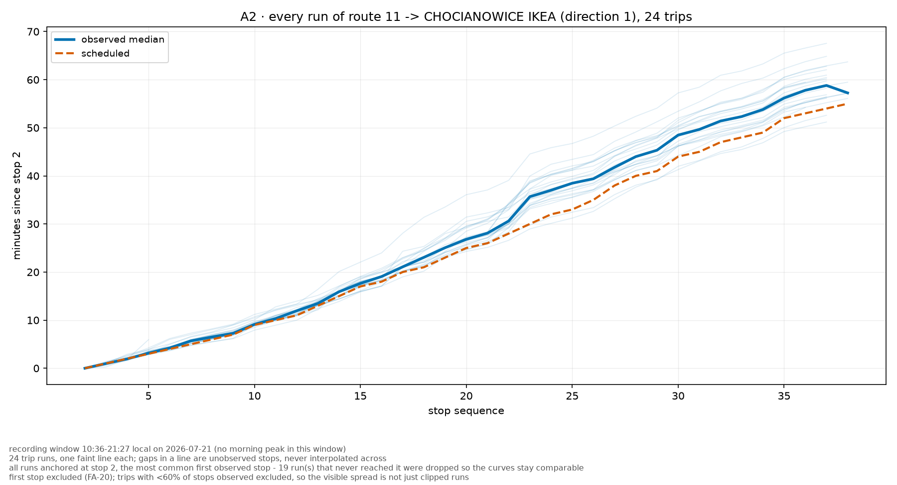

```bat
py -m transit_charts.cli chart A2 --table out\lodz_2026-07-21.csv.gz --route 11 ^
   --out-prefix out\charts\lodz_A2
```

X to numer przystanku, Y to minuty od przystanku kotwiczącego. Jedna blada linia na kurs plus
pogrubiona mediana obserwowana i przerywana linia rozkładowa.

**Jak to czytać.** Szerokość wiązki to zmienność, z którą realnie mierzy się pasażer — bez
żadnej statystyki. Wiązka, która idzie wąsko i rozjeżdża się na jednym przystanku, mówi, że
kłopot zaczyna się tam. Linia wyraźnie poniżej reszty to szybki kurs, powyżej — zły. Przerwy
w linii to nieobserwowane przystanki i nigdy nie są mostkowane. Wszystkie kursy są kotwiczone na
tym samym przystanku, a te, które nigdy do niego nie dojechały, są odrzucane i policzone
w podpisie — inaczej kurs ucięty oknem nagrywania startuje w połowie trasy i wygląda
spektakularnie szybko.

### C9 · rozkład opóźnień na każdym przystanku

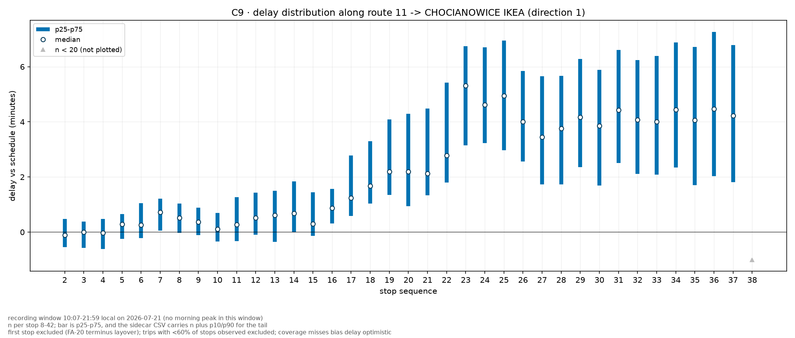

```bat
py -m transit_charts.cli chart C9 --table out\lodz_2026-07-21.csv.gz --route 11 ^
   --out-prefix out\charts\lodz_C9 --html
```

X to numer przystanku, Y to opóźnienie w minutach. Kropka = mediana, słupek = p25–p75.

**Jak to czytać.** Rosnące schodki znaczą, że opóźnienie kumuluje się wzdłuż trasy; pojedynczy
stopień znaczy, że powoduje je jeden segment. Rozszerzające się słupki znaczą, że linia staje
się *nieprzewidywalna*, co jest inną skargą niż „jest spóźniona" i zwykle gorszą. Szare trójkąty
przy osi to przystanki poniżej `--min-n`. Jedna linia i jeden kierunek — przystanek numer 5 jest
innym miejscem na każdej trasie, więc wykres odmawia ich uśredniania.

Rysowany jest **tylko pas p25–p75**. Zewnętrzny pas p10–p90, który tu kiedyś był, zamieniał
wykres w dwa zagnieżdżone bloki koloru, a decyle nadal są w bocznym CSV dla każdego, kto czyta
ogon rozkładu.

### C10 · percentyle opóźnienia w ciągu doby

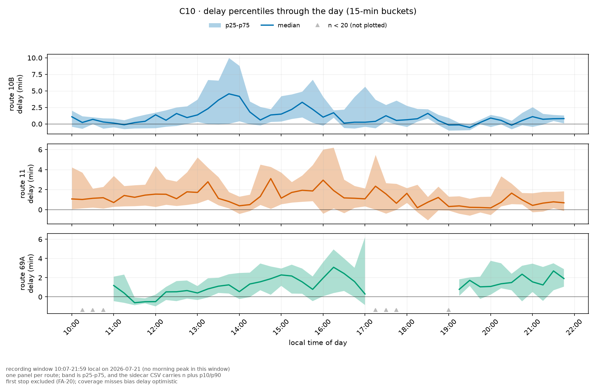

```bat
py -m transit_charts.cli chart C10 --table out\lodz_2026-07-21.csv.gz ^
   --route 11 --route 10B --route 69A --out-prefix out\charts\lodz_C10 --html
```

Jeden panel na linię. X to czas lokalny, Y to opóźnienie w minutach; linia = mediana,
pas = p25–p75.

**Jak to czytać.** Patrz na *pas*, nie na linię. Rozszerzający się pas przy płaskiej medianie to
linia, na której większość pojazdów jest w porządku, a rozjeżdża się przewidywalność — czego
żadna średnia nie pokaże. Przerwa w linii to kubełek poniżej `--min-n`, a nie kubełek z zerowym
opóźnieniem. Po sam ogon (p10/p90) sięgnij do bocznego CSV — na rysunku go nie ma, bo przy trzech
liniach zamieniał panele w mgłę nakładających się przezroczystości.

### C11 · struktura punktualności w ciągu doby

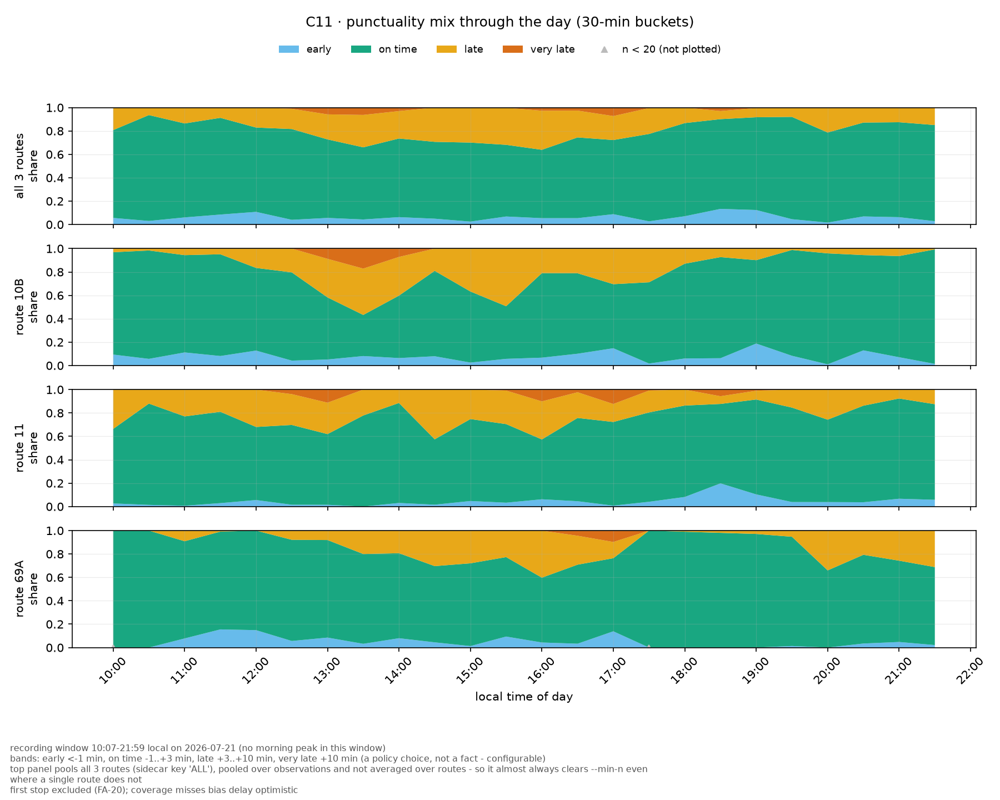

```bat
py -m transit_charts.cli chart C11 --table out\lodz_2026-07-21.csv.gz ^
   --route 11 --route 10B --route 69A --out-prefix out\charts\lodz_C11 --combine
```

Jeden panel na linię, skumulowane udziały klas: za wcześnie / o czasie / spóźniony / bardzo
spóźniony. Z `--combine` na górze dochodzi panel **wszystkich wybranych linii razem**.

**Jak to czytać.** Zielony pas to nagłówek: gdy się zwęża, punktualność siada. Pomarańcz
pojawiający się u góry to pogarszający się ogon, a nie środek rozkładu. Progi są decyzją
polityczną (domyślnie: za wcześnie < −1 min, o czasie −1…+3, spóźniony +3…+10, bardzo spóźniony
> +10) i są konfigurowalne. `n` na kubełek jest w bocznym CSV — stuprocentowo punktualny kubełek
zbudowany z czterech obserwacji nie jest wynikiem.

Panel zbiorczy liczy udziały **na puli obserwacji**, a nie jako średnią z udziałów
poszczególnych linii. To dwie różne wielkości i tylko jedna z nich jest liczbą o sieci:
uśrednianie pozwoliłoby linii z dziesięcioma kursami ważyć tyle, co linii z czterystoma. Wiersze
tego panelu mają w bocznym CSV `route_short_name = ALL`. Uwaga przy czytaniu: pula prawie zawsze
przekracza `--min-n`, także tam, gdzie pojedyncza linia go nie osiąga.

### B5 · regularność odstępów (CV — coefficient of variation, współczynnik zmienności), przystanek × godzina

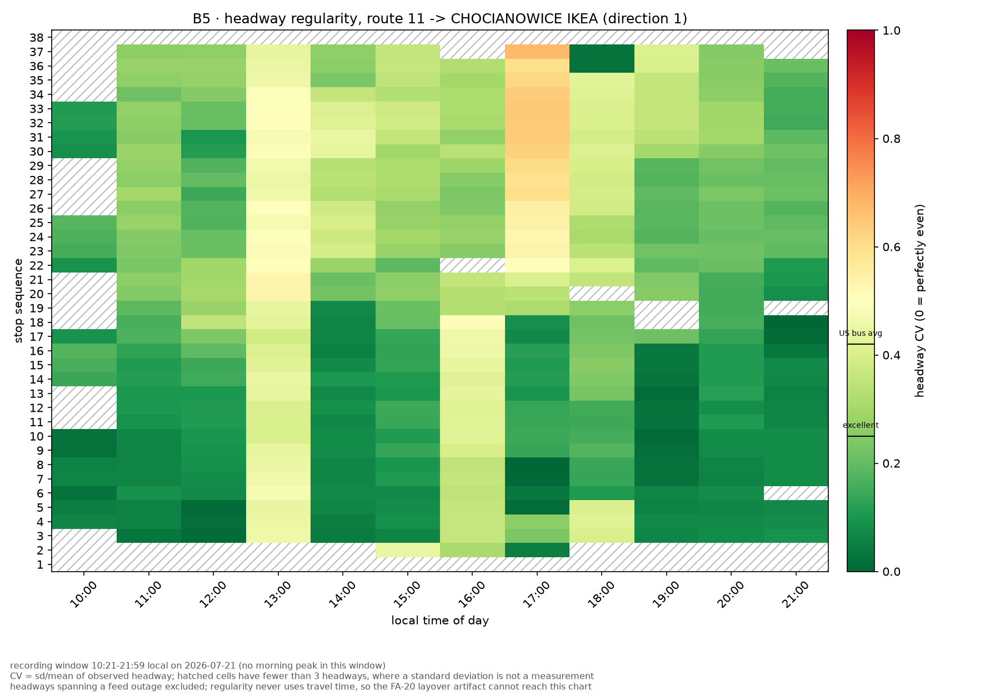

```bat
py -m transit_charts.cli chart B5 --table out\lodz_2026-07-21.csv.gz --route 11 ^
   --out-prefix out\charts\lodz_B5
```

Wiersze to przystanki w kolejności trasy, kolumny to godziny, kolor to współczynnik zmienności
obserwowanego odstępu. Zielony jest równy, czerwony poszarpany; na skali zaznaczone są 0,25
(„doskonale") i 0,42 (średnia autobusowa w USA).

**Jak to czytać.** **Poziomy** czerwony pas to godzina, w której poszła cała linia. **Pionowy**
czerwony pas to jeden przystanek, na którym dzieje się to zawsze — a zbijanie się pojazdów
w stada zaczyna się zwykle tuż przed nim, więc tam trzeba patrzeć. Komórki zakreskowane mają
mniej niż trzy odstępy, gdzie odchylenie standardowe nie jest pomiarem.

### B6 · rzeczywisty kontra rozkładowy czas oczekiwania

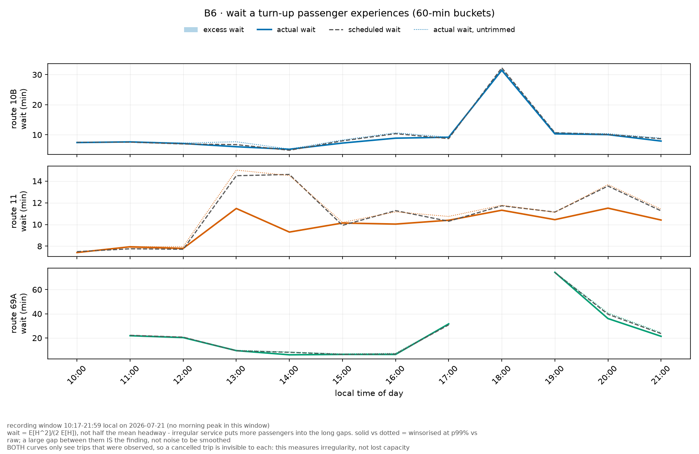

```bat
py -m transit_charts.cli chart B6 --table out\lodz_2026-07-21.csv.gz ^
   --route 11 --route 10B --route 69A --out-prefix out\charts\lodz_B6 --html
```

Jeden panel na linię. Ciągła = **AWT** (*actual wait time*, oczekiwanie, którego realnie
doświadcza pasażer przychodzący bez rozkładu), `E[H²]/(2·E[H])`; przerywana = **SWT** (*scheduled
wait time*, ta sama formuła na **rozkładowych** odstępach **tej samej pary pojazdów**); zacieniony
obszar między nimi to **EWT** (*excess wait time*, nadmiar oczekiwania ponad rozkład,
`EWT = AWT − SWT`). Kropkowana = AWT bez przycięcia.

**Jak to czytać.** To linia przerywana czyni ciągłą interpretowalną: łódzkie 10B czeka o 18:00
31 minut, a rozkład mówi 30 — ten szczyt jest planem, nie awarią. Szeroki zacieniony obszar to
nieregularność kosztująca pasażerów czas. Szeroka różnica między **ciągłą a kropkowaną** to
odkrycie przeciwnego rodzaju: jedna ogromna dziura dominująca statystykę kwadratową w odstępie —
i to jest wynik, a nie szum do wygładzenia.

### B7 · rozkład odstępów godzina po godzinie (ridgeline)

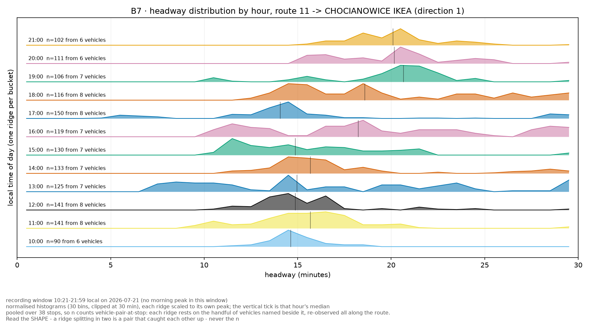

```bat
py -m transit_charts.cli chart B7 --table out\lodz_2026-07-21.csv.gz --route 11 ^
   --out-prefix out\charts\lodz_B7
```

X to odstęp w minutach, jeden grzbiet na godzinę, układane od dołu, każdy skalowany do własnego
maksimum. Pionowa kreska to mediana danej godziny.

**Jak to czytać.** Porównuj *kształty*, nigdy wysokości. Jeden wąski szczyt = kurs regularny.
Szczyt przesunięty w prawo = rzadziej, ale nadal równo. **Dwa garby — jeden przy 0–5 min i jeden
przy mniej więcej podwójnym odstępie — to zbijanie się w stada**: para pojazdów, które się
dogoniły, i dziura, którą po sobie zostawiły. Długi ogon w prawo to sporadyczne duże luki na
skądinąd porządnej obsłudze. Każdy grzbiet podaje i `n`, i liczbę *niezależnych pojazdów* za nim;
ufaj tej drugiej liczbie.

### B8 · częstość bunchingu, przystanek × godzina — jedna linia

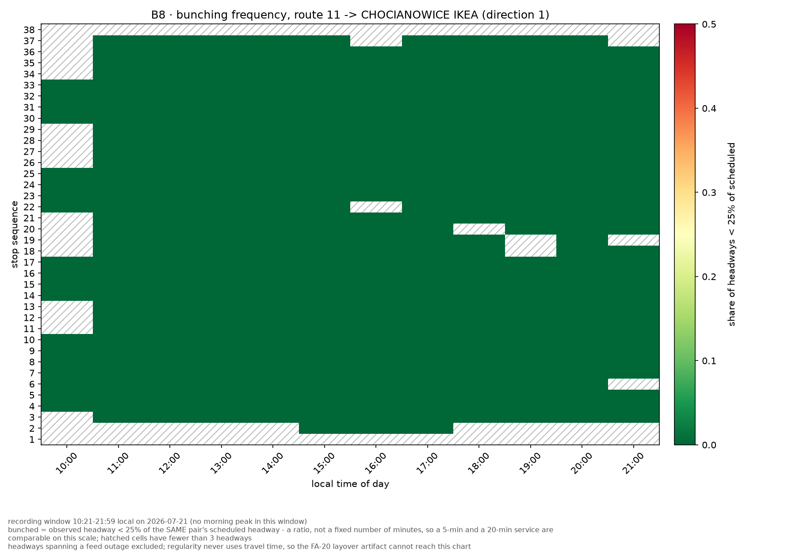

```bat
py -m transit_charts.cli chart B8 --table out\lodz_2026-07-21.csv.gz --route 11 ^
   --out-prefix out\charts\lodz_B8
```

Ten sam układ co B5 (wiersze = przystanki, kolumny = godziny), ale kolor to **udział headwayów
poniżej `--threshold`** (domyślnie 0,25) **własnego** rozkładowego odstępu tej samej pary
pojazdów — ułamek, nie stała liczba minut, żeby linia co 5 min i linia co 20 min były
porównywalne na jednej skali.

**Jak to czytać.** To lokalizator, którego brakuje w B7: ridgeline pokazuje, że bunching *gdzieś*
na trasie się zdarza, ten wykres pokazuje **gdzie**. Pionowy czerwony pas to przystanek, na
którym pary pojazdów regularnie się doganiają — zwykle tuż za faktyczną przyczyną (światła,
wąska jezdnia, przystanek na żądanie), nie w miejscu samej przyczyny.

### H28 · ranking regularności (CV) wszystkich linii

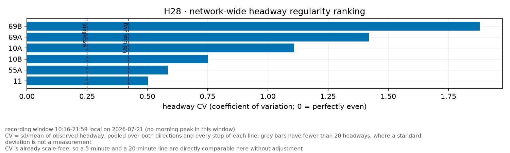

```bat
py -m transit_charts.cli chart H28 --table out\lodz_2026-07-21.csv.gz ^
   --out-prefix out\charts\lodz_H28
```

Bez `--route` (albo z kilkoma) — jeden słupek na linię, posortowany malejąco po CV, obie
kierunki połączone (ten sam precedens co B6). Kreski odniesienia przy 0,25 („doskonale") i 0,42
(średnia autobusowa w USA), jak w B5.

**Jak to czytać.** Sieciowa odpowiedź na pytanie, które dziś wymaga N heatmap B5 — która linia
w mieście jest najbardziej nieregularna, jednym spojrzeniem. CV jest już bezwymiarowe, więc
linia co 5 min i linia co 20 min stoją na tym samym wykresie bez korekty. Szare słupki to linie
poniżej `--min-n`, podpisane liczbą `n` zamiast zniknąć.

### H29 · ranking nadmiaru oczekiwania (EWT) wszystkich linii, dwa panele

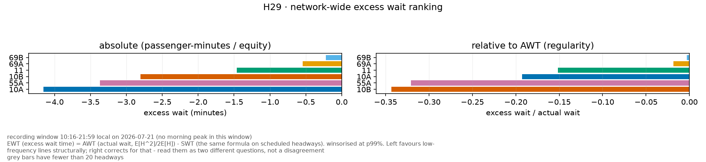

```bat
py -m transit_charts.cli chart H29 --table out\lodz_2026-07-21.csv.gz ^
   --out-prefix out\charts\lodz_H29
```

Dwa panele: lewy to EWT bezwzględny w minutach (rama sprawiedliwości — „gdzie tracimy najwięcej
osobominut"), prawy to EWT względem AWT (rama regularności — „która linia jest proporcjonalnie
najgorsza"). Ten sam kolor per linia w obu panelach.

**Jak to czytać.** Te dwa panele **celowo** dają różną kolejność słupków, i to nie jest błąd:
ranking bezwzględny strukturalnie faworyzuje linie rzadkie (większy rozkładowy odstęp → większe
`E[H²]/(2E[H])` nawet przy identycznej proporcjonalnej regularności), a panel względny to
koryguje. Czytać jako dwa różne pytania, nie jako niezgodność.

### H30 · częstość bunchingu, linia × godzina — całe miasto

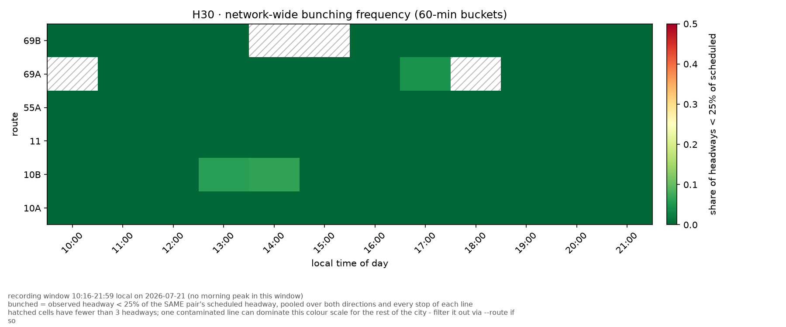

```bat
py -m transit_charts.cli chart H30 --table out\lodz_2026-07-21.csv.gz ^
   --out-prefix out\charts\lodz_H30
```

Sieciowe B8: wiersze to linie zamiast przystanków jednej linii, kolumny to godziny, kolor to ten
sam udział headwayów poniżej `--threshold` rozkładowego odstępu.

**Jak to czytać.** Które linie i które godziny mają realny problem ze zbijaniem się w stada,
przekrój przez całe miasto naraz. To jest wykres, w który `--exclude-route` wpada najbardziej
wprost — jedna patologiczna linia (np. gubiący się GPS produkujący fałszywe zera odstępu)
rozjeżdża skalę kolorów dla reszty miasta; wyklucz ją i policz resztę bez niej.

### D14 · prędkość segmentowa, segment × pasmo czasu

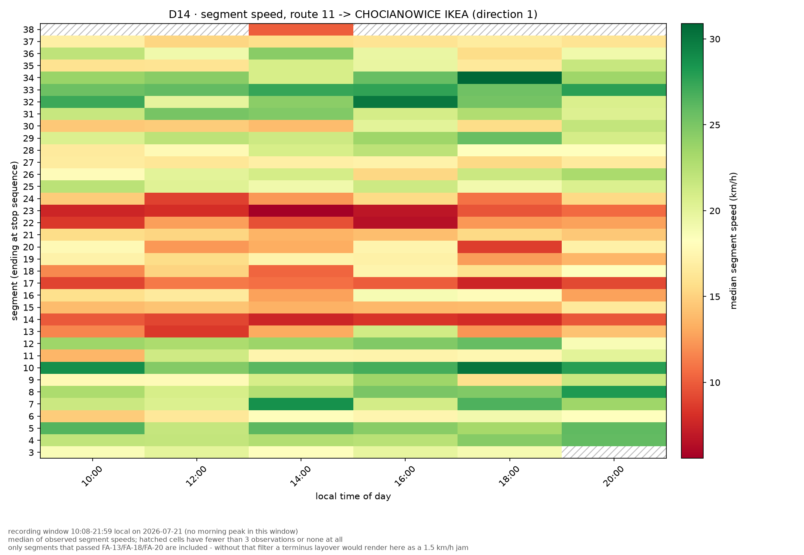

```bat
py -m transit_charts.cli chart D14 --table out\lodz_2026-07-21.csv.gz --route 11 ^
   --out-prefix out\charts\lodz_D14
```

Wiersze to segmenty w kolejności trasy, kolumny to pasma 2-godzinne, kolor to mediana prędkości
(km/h).

**Jak to czytać.** Ciemny wiersz to odcinek zawsze wolny; ciemna kolumna to pora, w której wolna
jest cała trasa; ciemna komórka na ich przecięciu to ta, do której warto pojechać popatrzeć.
Uwzględniane są wyłącznie segmenty, które przeszły FA-13/FA-18/FA-20 — bez tego filtra postój na
pętli renderuje się jako korek 1,5 km/h i wygląda całkiem sensownie.

### D17 · zapas w rozkładzie

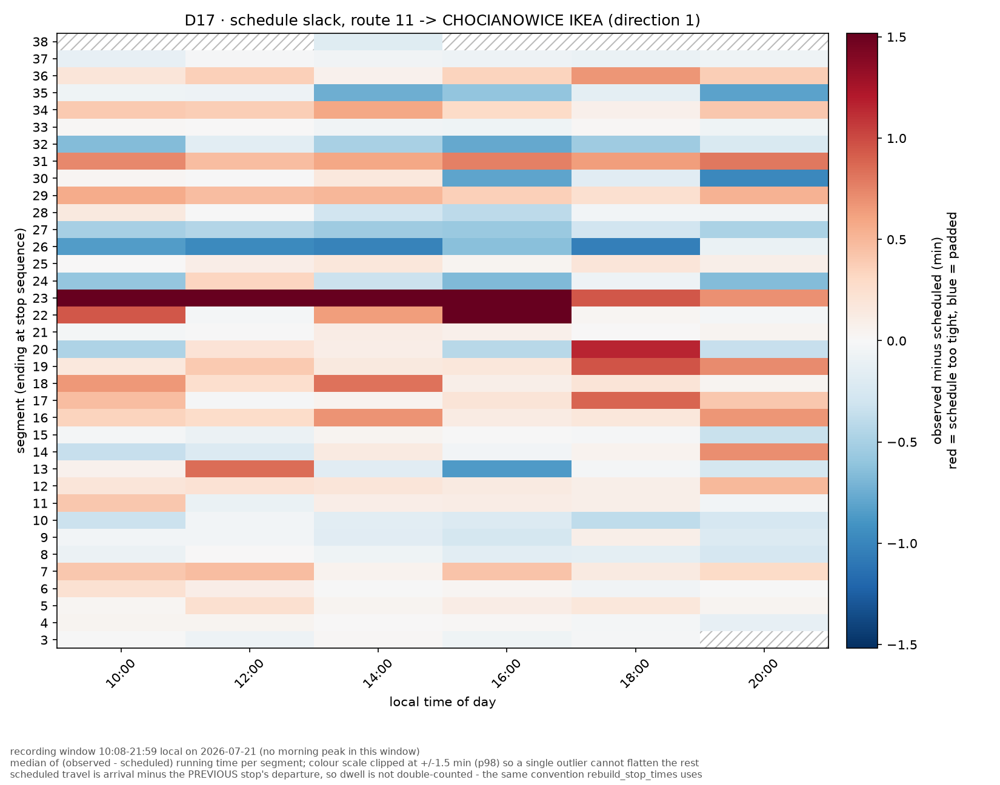

```bat
py -m transit_charts.cli chart D17 --table out\lodz_2026-07-21.csv.gz --route 11 ^
   --out-prefix out\charts\lodz_D17
```

Ten sam układ co D14; kolor to obserwowany minus rozkładowy czas przejazdu, rozbieżny wokół zera.

**Jak to czytać.** **Czerwony = rozkład jest tam za ciasny** i opóźnienie jest zaprojektowane;
**niebieski = jest zapas**, więc pojazdy przyjeżdżają za wcześnie i czekają. Te dwa wnioski mają
przeciwne lekarstwa, i dlatego ten wykres jest wart więcej niż zwykły wykres opóźnień. **To ten,
który zamienia pomiar w decyzję.** Czerwony wiersz utrzymujący się przez całą dobę to segment do
przerobienia rozkładowo — na łódzkiej 11 jest to segment 23, a C9 niezależnie pokazuje skok
opóźnienia linii dokładnie na przystankach 22–23.

### D15 · strata systematyczna kontra losowa — **potrzebuje ≥ 3 dni**

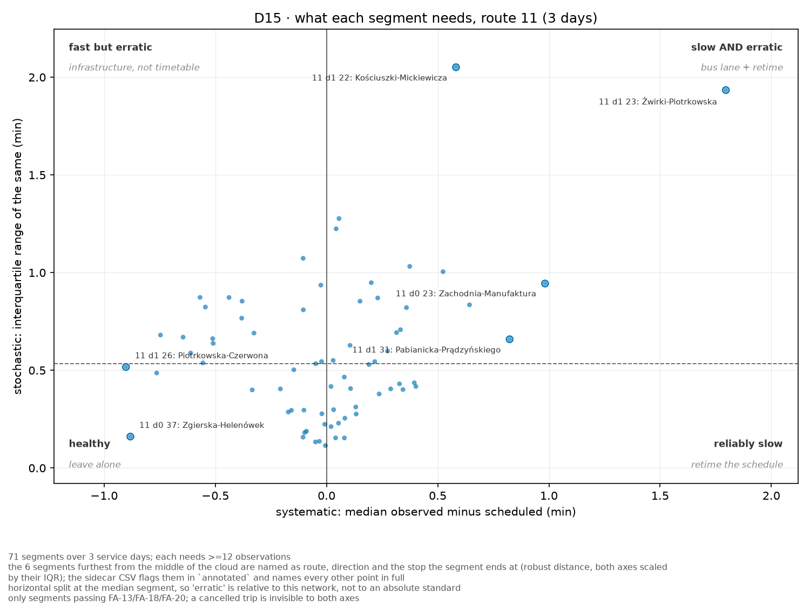

```bat
py -m transit_charts.cli chart D15 --route 11 --out-prefix out\charts\lodz_D15 
   --table out\lodz_2026-07-21.csv.gz --table out\lodz_2026-07-22.csv.gz 
   --table out\lodz_2026-07-23.csv.gz
```

Jeden punkt na segment. X = mediana różnicy obserwowany−rozkładowy w kolejnych dniach (część
trwała), Y = rozstęp ćwiartkowy tej samej różnicy (część zmienna).

**Jak to czytać.** Ćwiartki niosą rekomendację. Prawy dolny róg, *niezawodnie wolno*: przerobić
rozkład. Lewy górny, *szybko, ale nieprzewidywalnie*: infrastruktura, nie rozkład. Prawy górny
potrzebuje obu. Lewy dolny jest zdrowy. Podział poziomy jest medianą tej sieci, więc
„nieprzewidywalnie" jest relatywne, nie absolutne. Na jednym dniu wykres w ogóle odmawia
rysowania — trwałe przesunięcie i zmienność między kursami nie są rozdzielalne w obrębie
jednej doby.

Podpisane jest **N najbardziej odstających segmentów** (`--annotate`, domyślnie 6; `0` wyłącza).
„Odstający" znaczy: najdalszy od środka chmury po przeskalowaniu obu osi ich własnym rozstępem
ćwiartkowym — nie odchyleniem standardowym, bo to właśnie te kilka segmentów siedzi w odchyleniu
standardowym i definiowałyby skalę, która ma je znaleźć. Podpis wskazuje linię, numer przystanku
i nazwy obu końców segmentu; boczny CSV zaznacza wybrane w kolumnie `annotated` i nazywa również
wszystkie pozostałe punkty.

### E20 · międzymiastowy profil artefaktu

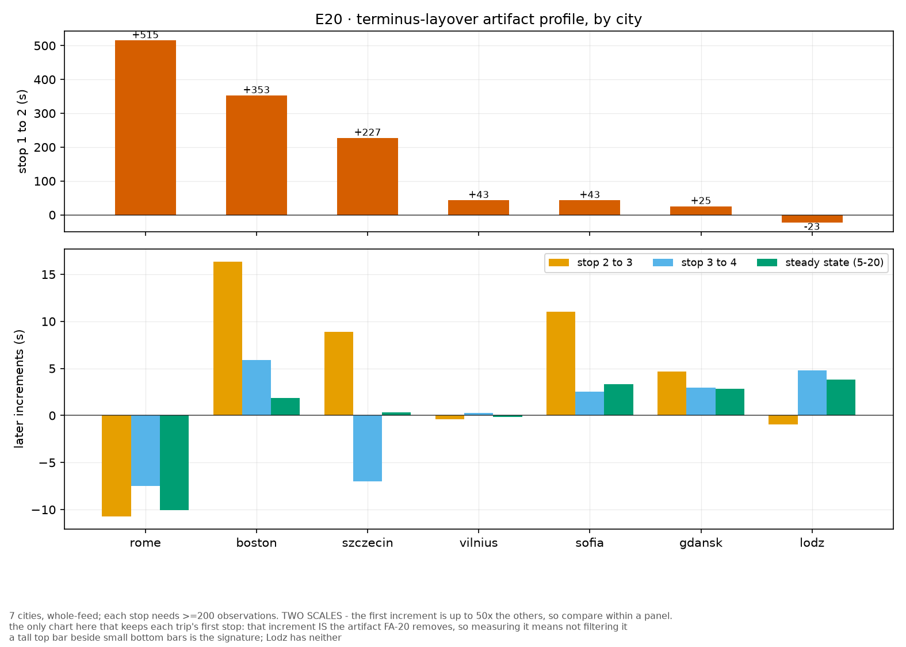

```bat
py -m transit_charts.cli chart E20 --out-prefix out\charts\E20 ^
   --table out\cities\rome_2026-07-29.csv.gz --table out\cities\lodz_2026-07-21.csv.gz
```

Dwa panele jeden nad drugim w **osobnych skalach**: przyrost opóźnienia na parze 1→2 u góry,
kolejne przyrosty u dołu. Ekstrahuj cały feed (bez `--route`) — tabela filtrowana po liniach nie
jest porównywalna z tabelą całego feedu.

**Jak to czytać.** Wysoki słupek u góry przy niskich słupkach u dołu to sygnatura postoju na
pętli. Równe słupki znaczą, że miasto tego zjawiska nie ma. Porównuj wewnątrz panelu, nigdy
między panelami.

---

## 5. Tabela tidy

Jeden wiersz na **rozkładowy przystanek** każdego przetworzonego kursu, łącznie z przystankami,
które nie wygenerowały przejazdu — pokrycie widać tylko wtedy, gdy braki są obecne. Kolumny są
wypisane w `tidy.TIDY_COLUMNS`; te, które niosą decyzje projektowe:

| kolumna | uwaga |
|---|---|
| `seg_status` | `ok` / `first_pair` / `stationary` / `implausible` / `gap` / `missing_stop_location` / `no_previous_stop`. **Odrzucenia są etykietowane, nie stosowane** — każdy wykres sam decyduje, co toleruje. Nigdy nie jest puste, więc filtrowanie to `== "ok"`, a nie pytanie o NaN. |
| `delay_s` | względem rozkładowego przyjazdu, na dacie serwisowej **wywnioskowanej z obserwacji**, nie założonej z nazwy pliku. |
| `headway_s` | do poprzedniego pojazdu tej samej linii/kierunku na tym samym przystanku *i tym samym `stop_sequence`*, więc dwa przejazdy trasy pętlowej nie są przeplatane. `NaN` dla pierwszego pojazdu w oknie — nigdy 0. |
| `sched_headway_s` | odstęp rozkładowy **tej samej pary pojazdów**, liczony na wierszach obserwowanych. Liczony po wszystkich wierszach dawał na łódzkiej 11 różnicę 16,16 vs 15,00 min czystego artefaktu pomiarowego. |
| `headway_skips_vehicles` | ile rozkładowych przyjazdów wypada *pomiędzy* dwoma obserwacjami — czyli „rozkład spodziewał się tu jeszcze jednego pojazdu". |
| `headway_spans_outage` | odstęp przecina ciszę feedu, więc mierzy nagrywanie, a nie obsługę. |
| `trip_coverage` | ułamek przystanków tego kursu, które zaobserwowano — uchwyt na obciążenie krawędzią okna nagrywania. |
| `trip_headsign` | kierunek tak, jak jest wypisany na pojeździe. Opcjonalny w GTFS; puste pole oznacza feed, który go nie wypełnia, a nie błąd ekstrakcji. |
| `service_date_plausible` | `False`, gdy żadna kandydująca data serwisowa nie tłumaczy obserwacji (recyklowany `trip_id`, zła wersja feedu). Oznaczane, nigdy nieusuwane. |

## 6. Czego te liczby dowodzą, a czego nie

- **Pokrycie przejazdów przez przystanki jest wysokie, ale braki nie są losowe.** Łódź
  2026-07-21, sześć obserwowanych linii: 15 089 z 17 276 rozkładowych przystanków (**87,3 %**).
  Pojazd, który znika z feedu *stojąc w korku*, nie wnosi nic — więc każda krzywa opóźnień tutaj
  jest obciążona **optymistycznie**.
- **Okna nagrywania mają ~16 h i zaczynają się przed południem** (Łódź 10:07–21:59 czasu
  lokalnego). W tych danych **nie ma szczytu porannego**; każde twierdzenie „w ciągu doby" musi
  to powiedzieć.
- **Filtry FA-13/14/18/20 są przenoszone, nie reimplementowane.** `collect_stop_crossings`
  w `family_a` to ta sama, utwardzona ścieżka kodu, a test równoważności
  w `family_a_reconstruction/tests/test_segment_stats.py` pęka, jeśli obie kiedykolwiek się
  rozjadą.
- **Interpolacja to nie obserwacja.** Przejazd przez przystanek jest interpolowany liniowo między
  pingami GPS oddalonymi nawet o 300 s.

## 7. Kilka dni: które wykresy tego chcą, a którym to szkodzi

`--table` jest powtarzalna i każdy wykres skleja to, co dostanie. Dla jednych jest to przydatne,
dla innych mylące, więc narzędzie **mówi na stderr, ilekroć weszło więcej niż jeden dzień
serwisowy**, i ostrzega ponownie, gdy dni obejmują różne `day_type` — sobota wrzucona do
statystyki dnia roboczego różni się, bo różni się *rozkład*, a nie dlatego, że obsługa była
zawodna.

Podział wynika z tego, ile danych mieści jedna komórka każdego wykresu. Zmierzone na łódzkiej
linii 11, kierunek 1:

| wykres | kubełek | mediana n, 1 dzień | mediana n, 3 dni |
|---|---|---:|---:|
| B5, B7 | 60 min × przystanek | **3** | 9 |
| D14, D17 | 120 min × segment | **7** | 20 |
| C9, C10, C11, B6 | 15 min × linia | 64 | 176 |

- **Łącz dni: `B5`, `B7`, `D14`, `D17`.** Komórka tych wykresów to jedna para przystanków w jednym
  paśmie czasu, więc ogranicza ją liczba pojazdów, które przejechały — trzy na linii
  z częstotliwością 15 minut. Odchylenie standardowe albo kształt rozkładu z n=3 nie są pomiarem.
  To dla tych wykresów trzyma się na dysku kilka dni, a łączenie dni roboczych jest zamierzonym
  użyciem.
- **Porównuj dni, nie łącz: `C9`, `C10`, `C11`, `A2`, `B6`.** Te osiągają `n` w setkach już
  w jednym dniu, więc łączenie kupuje stabilność, której nie potrzebują, i *kosztuje* to, co warto
  zobaczyć: jeden zły wtorek znika w średniej. Dla nich sygnałem jest zmienność między dniami,
  a właściwą formą jest jedna seria na dzień, a nie jedna seria po wszystkich dniach.
  **Tryb porównania dzień po dniu nie jest jeszcze zbudowany** — podanie kilku dni dziś je łączy
  i teraz to mówi.
- **Wielodniowe z założenia: `D15`, `E20`.** D15 na jednym dniu w ogóle nie działa; E20 łączy to,
  co wniesie każde miasto.

## 8. E20 — międzymiastowy profil artefaktu

`E20` jest wyjątkiem i to celowo: **jako jedyny zachowuje pierwszy przystanek każdego kursu**,
bo wielkość tego pierwszego przyrostu *jest* tematem. Wszędzie indziej pierwszy przystanek jest
usuwany, bo ląduje na nim postój na pętli (FA-20).

Bierze po jednej tabeli tidy na miasto i raportuje medianę przyrostu opóźnienia między kolejnymi
wczesnymi przystankami. Zmierzone na siedmiu miastach, wszystkie ekstrahowane **z całego feedu**
(tabela filtrowana po liniach nie jest z tym porównywalna, więc nie wolno ich mieszać):

| miasto | przystanek 1→2 | 2→3 | 3→4 | stan ustalony (5–20) |
|---|---:|---:|---:|---:|
| Rzym | **+515,3 s** | −10,7 | −7,5 | −10,1 |
| Boston | **+352,7 s** | +16,4 | +5,9 | +1,9 |
| Szczecin | **+227,4 s** | +8,9 | −7,0 | +0,3 |
| Wilno | +43,1 s | −0,4 | +0,3 | −0,1 |
| Sofia | +43,0 s | +11,0 | +2,5 | +3,3 |
| Gdańsk | +25,4 s | +4,7 | +3,0 | +2,9 |
| **Łódź** | **−22,7 s** | −1,0 | +4,8 | +3,8 |

Sygnaturą jest stosunek, a nie liczba bezwzględna: pierwszy przyrost Rzymu jest ~50× większy od
drugiego, a Łódź nie ma go wcale. To jest argument FA-20, odtworzony z wysyłanego pipeline'u.

Rysowany jako **dwa panele w osobnych skalach** — pierwszy przyrost u góry, kolejne u dołu. Na
jednej osi +515 s Rzymu spłaszcza każdą inną serię do linii zera i wykres pokazuje wyłącznie to,
co i tak było oczywiste. Wyrzucenie serii 1→2 naprawiłoby czytelność przez skasowanie pomiaru,
więc dostaje własną skalę. Porównuj wewnątrz panelu, nigdy między panelami.

**To nie są te same liczby co w tabelach PRD i nie wolno ich cytować, jakby były.** PRD mierzył
łączne opóźnienie w *opublikowanym zrealizowanym feedzie*; tutaj mierzony jest surowy
interpolowany przejazd przez przystanek 1 względem jego rozkładu, który zawiera cały postój,
a nie jego uśredniony efekt w dalszej części trasy — stąd wartości o rząd wielkości większe.
Uporządkowanie zgadza się na obu końcach (Rzym i Boston najgorsze, Łódź czysta), ale nie
w środku: **Gdańsk jest tu 6. z 7, a w tabeli prędkości pierwszej pary w PRD 4. z 9** — co jest
niewyjaśnione i warte sprawdzenia, zanim którakolwiek z tabel zostanie zacytowana.

## 9. Interaktywny HTML (opcjonalnie)

`--html` zapisuje `<prefix>.html` obok PNG dla `C9`, `C10` i `B6`. Jeden samowystarczalny plik:
CSS i JS inline, referencyjny PNG osadzony jako data URI, żadnego dostępu do sieci. Renderuje
**tę samą boczną tabelę, którą zapisał PNG**, więc nie mogą się rozjechać; najechanie kursorem
daje dokładne wartości i `n` za każdym punktem, a tabela danych sortuje się po dowolnej kolumnie.

Wykresy bez sensownej formy interaktywnej (mapy cieplne, ridgeline) mówią to i zapisują wyłącznie
PNG, zamiast produkować gorszą wersję samych siebie.

## 10. Publikacja — co przetrwa w release, a co nie

Ustalenie do zapisania, zanim ktokolwiek zaplanuje te wykresy na dashboardzie:
**opublikowany CSV nie wystarcza do ich zbudowania.**

- W release'ach `easy-GTFS-RT` leży pięć plików: `<city>_realized_<date>_p50.zip`, `…_p85.zip`,
  `<city>_static_gtfs_<date>.zip`, `<city>_diff_<date>_p50_chart.png` i
  `<city>_diff_<date>_p50_summary.csv`.
- `…_summary.csv` ma **dziewięć kolumn i jeden wiersz na `route_id`** plus wiersz `ALL`
  (`tools/analysis/gtfs_static_vs_realized_diff.py`). Nie ma w nim osi czasu, przystanku, kursu
  ani pojazdu. Utrzyma dokładnie jeden wykres — ten, który już jest publikowany. Żadnego
  z jedenastu tutaj.
- `matched.csv` powstaje na runnerze i **nigdy nie jest wgrywany** — ginie razem z jobem. Surowe
  snapshoty `.pb` idą do release'u `positions-raw-*`, który ten sam workflow kasuje po zbudowaniu
  feedu.
- Feed P50 nie jest zamiennikiem wejścia z powodów opisanych w dodatku „Dlaczego nie buduje się
  tego z feedu P50" na końcu dokumentu, a dla gałęzi B jest wręcz niezdefiniowany.
- Co przeżywa i naprawdę się liczy: `<city>_static_gtfs_<date>.zip`, czyli **ta** publikacja
  rozkładu, która pasuje do dnia. To połowa tego, czego potrzebuje `extract`.

**Rekomendacja:** dopiąć do workflow krok `transit_charts extract` i wgrywać
`<city>_tidy_<date>.csv.gz` do release'u. Tabela tidy jest spakowana gzipem, ma jeden wiersz na
rozkładowy przystanek (a nie na ping), niesie wszystkie kolumny czytane przez piętnaście wykresów
i dziedziczy filtry FA-13/18/20 przez `seg_status`, zamiast je odtwarzać. Matplotlib nie jest tu
przeszkodą: runner i tak go instaluje na potrzeby wykresu diff, a telefon nigdy nie dotyka
`transit_charts/requirements.txt`.

Do czasu tej zmiany jedyne, co da się opublikować, to rendery z dni-miast leżących lokalnie na
dysku. To przesądza kolejność prac: najpierw utrwalanie tabeli tidy, potem strona.

## 11. F21 — kontrakt danych dla porównania dostępności (niezbudowane)

`F21` (dostępność realizowalna kontra rozkładowa) potrzebuje łańcucha OpenTripPlanner /
service-time, który mieszka we wtyczce, nie w tym narzędziu. To, co `transit_charts` jest mu
winien, jest zapisane tutaj, żeby tamta strona dała się zbudować bez ponownego wyprowadzania
tego wszystkiego:

- **Zrealizowany GTFS, nie tabela.** Łańcuch dostępności trasuje po feedzie, więc wejściem jest
  istniejący build P50/P85 z `family_a` — to narzędzie nic do tej ścieżki nie dokłada.
- **To, co wnosi to narzędzie, to warstwa uczciwości**: per miasto-dzień liczby z `QualityReport`
  (pokrycie przejazdów, przerwy, przestarzałe obserwacje, niewiarygodne daty serwisowe) oraz
  profil E20. Różnica dostępności policzona w dniu z dwugodzinną przerwą w feedzie nie jest
  odkryciem o transporcie, a nic dalej w łańcuchu nie jest w stanie tego stwierdzić, jeśli te
  liczby nie podróżują razem z feedem.
- **Proponowany eksport**: `city, service_date, stops_total, stops_crossed, crossing_rate,
  outage_count, outage_max_s, stale_observations, trips_implausible_service_date` — jeden wiersz
  na miasto-dzień, złączalny z tym, co wyprodukuje przebieg dostępności.
- **Pytanie świadomie zostawione otwarte**: czy porównanie dostępności ma używać P50 (typowy
  dzień) czy P85 (pesymistyczny). To decyzja modelowa o tym, co znaczy „realizowalna", i należy
  do pytania badawczego, nie do tego narzędzia.

## 12. Testy

```bat
set PYTHONPATH=.
.venv\Scripts\python.exe -m pytest tests -q
```

Testy warte poznania, bo każdy pilnuje pułapki, a nie szczęśliwej ścieżki:
`test_pandas_timedelta_arithmetic_is_the_thing_this_module_avoids` (pandas przesuwa odjazd
z 08:00 na 09:00 przy zmianie czasu; biblioteka standardowa nie), przypadek przestarzałych
znaczników czasu z Lizbony w `test_quality.py` oraz przypadki trasy pętlowej i pierwszego pojazdu
w `test_tidy.py`.

---

## 13. Dlaczego nie buduje się tego z feedu P50

Oczywistym wejściem byłby zrealizowany GTFS P50, który pipeline i tak publikuje. Nie działa,
z trzech niezależnych powodów, i warto je znać, zanim ktoś spróbuje ponownie:

- `rebuild_stop_times` kotwiczy każdy kurs na jego **rozkładowym pierwszym odjeździe**, więc
  odchyłka na przystanku 1 jest zerowa *z definicji* — punktualność odjazdu w tym feedzie nie
  istnieje;
- mediany segmentów są kubełkowane w **blokach 2-godzinnych po rozkładowym odjeździe**, więc
  profil doby narysowany z tego feedu ma ~12 realnych wartości, a wszystko drobniejsze jest
  artefaktem granic kubełka, który przekonująco udaje szczyt komunikacyjny;
- iteruje po **wszystkich kursach ze statycznego feedu**, także tych, których nikt nie
  obserwował. To syntetyczny „typowy dzień", a nie zapis tego, co się wydarzyło.

Dla gałęzi B feed P50 jest wręcz **niezdefiniowany**: nie ma w nim rozróżnialnych pojazdów, więc
odstęp między nimi nie istnieje jako wielkość.

`matched.csv` to produkt pośredni, w którym informacja o pojedynczym pojeździe jeszcze jest.
